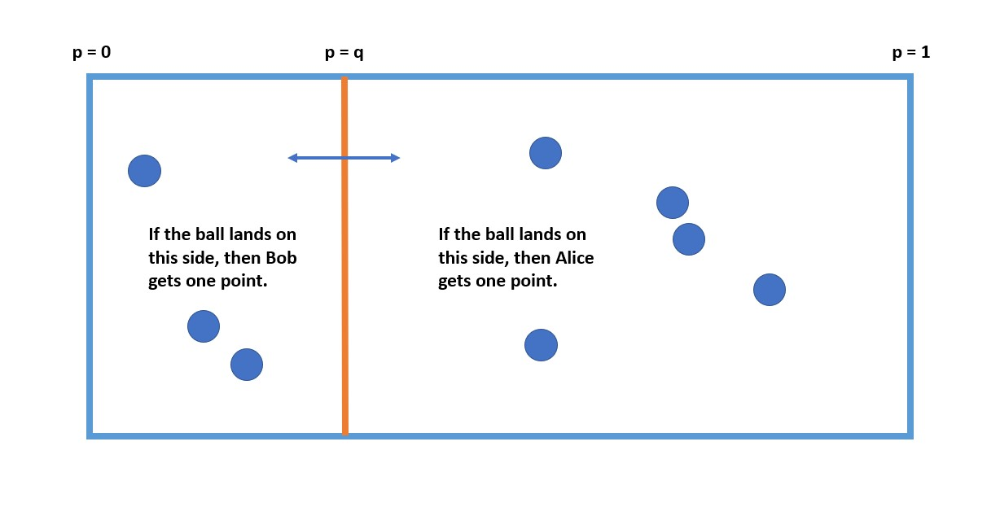

```{r setup, include=FALSE}
knitr::opts_chunk$set(echo = TRUE)
library(reticulate)
use_python("/usr/bin/python3")
matplotlib <- import("matplotlib")
matplotlib$use("Agg", force = TRUE)
#knitr::knit_engines$set(python = reticulate::eng_python)
```

## Review   

The general process of hypothesis testing can be described as:   

1.	Define a sampling plan and collect data following the plan    
2.	Select the test statistic to be used     
3.	Determine the null distribution for the null hypothesis H0   
4.	Define a cutoff value, alpha, which determines the acceptable the Type. I Error rate      
5.	Compute the statistic for the data (observations)       
6.	Given the value of the statistic compute the p-value. The p-value is the area (integral) under the null distribution from the statistic to the limit of the distribution (+/- infinity). The p-value represents the probability of the statistic being as extreme or more extreme than the one observed       
7. Compare the p-value to the cutoff selected   

## Review   

Compare the p-value to the cutoff selected    

There are only two possible conclusions    

1.	We **reject** the null hypothesis with confidence alpha (on the p-value)        

2.	We **cannot reject** the null hypothesis since either, i) the null hypothesis is true and there is no difference between the data distribution of the null distribution, or ii) there is insufficient evidence given the effect size to reject the null hypothesis (insufficient power)  


Beware of multiple hypothesis tests:  

- High error rate    

- Can end up 'p-value fishing'   


## Review   

For one-tailed test of hypothesis

- $H_0: \mu = \mu_0$ vs $H_a: \mu > \mu_0$
- if the statistic falls in the **critical (red) region**, we reject $H_0$ because p-value $< \alpha$ (top graph)
- if the statistic falls in the **blue region**, we fail to reject $H_0$ because p-value $> \alpha$ (bottom graph)


## Review   

There are a great many tests to choose from      

- Correct choice depends on the nature of the hypothesis to be tested and the nature of the data   
- Some common options include:   


| Data |	Hypothesis | 	Distribution |	Test | 
|:-- |:-- |:-- | :-- |
|Two samples of continuous variable |	Difference of means	| t |	t-test |
| Counts for different categories | Counts are different	| $\chi^2$ |	Pearson’s $\chi^2$ |
| Multiple (groups) of continuous variables |	Distribution of groups are different |	$F = \frac{between\ group\ variance}{within\ group\ variance}$ |	ANOVA |
| Sample from a distribution|	Does the variable have a distribution |	Kolmogorov-Smirnov |
	Kolmogorov-Smirnov |


## Introduction   

Despite the long history, Bayesian models have not been used extensively until recently    

- Two traditions in statistics    
   - Frequentist we have been working with previously    
   - Bayesian statistics   

- Limited use is a result of several difficulties   
   - Rarely taught for much of the 20th Century   
   - The need to specify a **prior distribution** has proved a formidable intellectual obstacle    
   - Modern Bayesian methods are often computationally intensive and have become practical only with cheap computing    \
   - Slow acceptance of **empirical Bayes** methods to bridge gap between frequentist and Bayesian methods. 
   
- Recent emergence of improved software and algorithms has resulted in wide and practical access to Bayesian methods         


## Introduction    

Bayesian analysis is a contrast to frequentist methods          

-	The objective of Bayesian analysis is to compute a posterior distribution    
   - Contrasts with frequentist statistics is to compute a point estimate and confidence interval from a sample      


-	Bayesian models allow expressing prior information in the form of a prior distribution       
   - Selection of prior distributions can be performed in a number of ways      

-	The posterior distribution is said to quantify our current **belief**     
   - We update beliefs based on additional data or evidence    
   - A critical difference with frequentist models which must be computed from a complete sample   
  
-	Inference can be performed on the posterior distribution by finding the maximum a postiori (MAP) value and a credible interval    


## Bayesian Model Use Case

Bayesian methods made global headlines with the successful location of the missing Air France Flight 447   

- Aircraft had disappeared in little traveled area of the South Atlantic Ocean     

- Conventional location methods had failed to locate the wreckage; potential search area too large    
- Bayesian methods rapidly narrowed the prospective search area   
   - Used 'prior information' on aircraft heading and time of sattelite transmisison  


```{r AirFrance447, out.width = '35%', fig.cap='Posterior distribution of locations of Air France 447', fig.align='center', echo=FALSE}
knitr::include_graphics(rep("../images/AirFrance447_posterior_PDF.png"))
```


## Bayesian vs. Frequentist Views

With greater computational power and general acceptance, Bayes methods are now widely used    

- Among pragmatists     
   - Some problems are better handled by frequentist methods    
   - Some problems with Bayesian methods    

- Bayes models allow us to express **prior information**    

- Models that fall between these extremes are also in common use    
  - Methods include the so-called **empirical Bayes** methods.  


## Bayesian vs. Frequentist Views       

Can compare the contrasting frequentist and Bayesian approaches   


```{r FrequentistBayes, out.width = '60%', fig.cap='Comparison of frequentist and Bayes methods', fig.align='center', echo=FALSE}
knitr::include_graphics(rep("../images/FrequentistBayes.jpg"))
```


## Review of Bayes Theorem

Bayes' Theorem is fundamental to Bayesian data analysis.    

- Start with: 

$$P(A \cap B) = P(A|B) P(B) $$

We can also write: 

$$P(A \cap B) = P(B|A) P(A) $$

Eliminating $P(A \cap B):$

$$ P(B)P(A|B) = P(A)P(B|A)$$

Or, **Bayes theorem!** 

$$P(A|B) = \frac{P(B|A)P(A)}{P(B)}$$

## Marginal Distributions   

In many cases we are interested in the **marginal distribution**      

- Example, it is often the case that only one or a few parameters of a joint distribution will be of interest     
  - In other words, we are interested in the marginal distribution of these parameters   
  - The denominator of Bayes theorem, $P(data)$, can  be computed as a marginal distribution   

- Consider a multivariate probability density function with $n$ variables, $p(\theta_1, \theta_2, \ldots, \theta_n)$     
  - **Marginal distribution** is the distribution of one variable with the others integrated out.  
  - Integrate over all other variables $\{ \theta_2, \ldots, \theta_n \}$ the result is the marginal distribution, $p(\theta_1)$:       

$$p(\theta_1) = \int_{\theta_2, \ldots, \theta_n} p(\theta_1, \theta_2, \ldots, \theta_n)\ d\theta2, \ldots, d \theta_n$$
- But computing this integral is not easy! 

## Marginal Distributions  

- For discrete distributions compute the marginal by summation   

- Or, for discrete samples of a continuous distribution   

- Example, we know posterior distribution of a parameter $\theta$ but really want marginal distribution of the parameter value   

$$
p(\theta) = \sum_{x \in \mathbf{X}} p(\theta |\mathbf{X})\ p(\mathbf{X}) 
$$

- Now we have the marginal distribution of $\theta$

- Or, we need to find the denominator for Bayes theorem to normalize our posterior distribution:

$$
p(\mathbf{X}) = \sum_{\theta \in \Theta} p(\mathbf{X} |\theta) p(\theta) 
$$

- We can compute $p(\mathbf{X})$ from samples without ever solving the integral directly!

## Interpreting Bayes Theorem

How can you interpret Bayes' Theorem? 

- For model parameter estimation problem: 

$$Posterior\ Distribution = \frac{Likelihood \bullet Prior\ Distribution}{Evidence} $$

- Or, Bayes' theorem in terms of model parameters:   

$$
posterior\ distribution(𝑝𝑎𝑟𝑎𝑚𝑒𝑡𝑒𝑟𝑠│𝑑𝑎𝑡𝑎) = \\ \frac{Likelihood(𝑑𝑎𝑡𝑎|𝑝𝑎𝑟𝑎𝑚𝑒𝑡𝑒𝑟𝑠)\ 𝑃rior(𝑝𝑎𝑟𝑎𝑚𝑒𝑡𝑒𝑟𝑠)}{P(data)}
$$

- Summarized as: 

$$
𝑃(𝑝𝑎𝑟𝑎𝑚𝑒𝑡𝑒𝑟𝑠│𝑑𝑎𝑡𝑎) = \frac{P(𝑑𝑎𝑡𝑎|𝑝𝑎𝑟𝑎𝑚𝑒𝑡𝑒𝑟𝑠)\ 𝑃(𝑝𝑎𝑟𝑎𝑚𝑒𝑡𝑒𝑟𝑠)}{P(data)}
$$


## Interpreting Bayes Theorem

What do these terms actually mean?    

1. **Posterior distribution** of the parameters given the evidence or data, the goal of Bayesian analysis      

2. **Prior distribution** is chosen to express information available about the model parameters apriori         

3. **Likelihood** is the conditional distribution of the data given the model parameters       

4. **Data** or **evidence** is the distribution of the data and normalizes the posterior   

Relationships can apply to the parameters in a model; partial slopes, intercept, error distributions, lasso constants, etc 


## Applying Bayes Theorem

We need a tractable formulation of Bayes Theorem for computational problems     

- We must avoid directly summing all of the possibilities to compute the denominator, $P(B)$    
   - In many cases, computing this denominator directly is intractable      

- Some interesting facts about conditional probabilities:   

$$
𝑃(𝐵 \cap A) = 𝑃(𝐵|𝐴)𝑃(𝐴) \\
And \\
𝑃(𝐵)=𝑃(𝐵 \cap 𝐴)+𝑃(𝐵 \cap \bar{𝐴}) 
$$

Where, $\bar{A} = not\ A$, and the marginal distribution, $P(B)$, can be written:   

$$
𝑃(𝐵)=𝑃(𝐵|𝐴)𝑃(𝐴)+𝑃(𝐵│ \bar{𝐴})𝑃(\bar{𝐴})
$$

## Applying Bayes Theorem    

Using the foregoing relations we can rewrite Bayes Theorem as:

$$ P(A|B) = \frac{P(A)P(B|A)}{𝑃(𝐵│𝐴)𝑃(𝐴)+𝑃(𝐵│ \bar{𝐴})𝑃(\bar{𝐴})} \\ $$

- Computing the denominator requires summing all cases in the subsets $A$ and $not\  A$      
    - This is a bit of a mess!    
    - Fortunately, we can often avoid computing this denominator by force     
    
Rewrite Bayes Theorem as:

$$𝑃(𝐴│𝐵)=𝑘∙𝑃(𝐵|𝐴)𝑃(𝐴)$$

Ignoring the normalization constant $k$:

$$𝑃(𝐴│𝐵) \propto 𝑃(𝐵|𝐴)𝑃(𝐴)$$


## Interpreting Bayes Theorem

Denominator must account for all possible outcomes, or alternative hypotheses, $h'$:   

$$Posterior(hypothesis\ |\ evidence) =\\ \frac{Likelihood(evidence\ |\ hypothesis)\ prior(hypothesis)}{\sum_{ h' \in\ All\ possible\ hypotheses}Likelihood(evidence\ |\ h')\ prior(h')}$$

This is a formidable problem!    


## Bayes Theorem Example

Hemophilia is a serious genetic condition expressed on any X chromosome    

- Women have two X chromosomes and are unlikely to exhibit hemophilia  
  - One X chromosome inherited from each parent    
  - Must inherit hemophilia from both parents   

- Men have one X chromosome and one Y chromosome   
  - Inherit Y chromosome from the father   
  - Inherit X chromosome, and possibly hemophilia, from the mother    
  
- Say a woman has a brother who exhibits hemophilia   
  - Y chromosome expression is $\theta = 1.0$  
  - Woman's father does not exhibit hemophilia, $\theta = 0$
  - Our prior probability that she carries the genetic marker for hemophilia $\theta = 0.5$


## Bayes Theorem Example  

As evidence the woman has two sons (not identical twins) with no expression of hemophilia      

- What is the likelihood for the two sons $X = (x_1,x_2)$ not having hemophilia?   

- Two possible cases here
  - Case where woman caries one X chromosome with hemophilia expression, $\theta = 1$
  - Case where woman does not carry an X chromosome with hemophilia expression, $\theta = 0$   
 
$$
p(x_1=0, x_2=0 | \theta = 1) = 0.5 * 0.5 = 0.25  \\
p(x_1=0, x_2=0 | \theta = 0) = 1.0 * 1.0 = 1.0 
$$
 
Note: we are neglecting the possibility of a mutations in one of the sons 


## Bayes Theorem Example  

Use Bayes theorem to compute probability woman carries an X chromosome with hemophilia expression, $\theta = 1$

$$
p(\theta=1 | X) = \frac{p(X|\theta=1) p(\theta=1)}{p(X|\theta=1) p(\theta=1) + p(X|\theta=0) p(\theta=0)} \\
= \frac{0.25 * 0.5}{0.25 * 0.5 + 1.0 * 0.5} = 0.20
$$

The evidence of two sons without hemophilia causes us to update our **belief** that the probability of the woman carrying the disease

**Note:** The denominator is the sum over all possible hypthises, the marginal distribution of the observations $\mathbf{X}$


## Simplified Relationship for Bayes Theorem

How to we interpret the foregoing relationship?     

Rewrite Bayes Theorem as:

$$𝑃(𝐴│𝐵)=𝑘∙𝑃(𝐵|𝐴)𝑃(𝐴)$$

Ignoring the normalization constant $k$:

$$𝑃(𝐴│𝐵) \propto 𝑃(𝐵|𝐴)𝑃(𝐴)$$

- Consider the following relationship:

$$Posterior\ Distribution \propto Likelihood \bullet Prior\ Distribution \\
Or\\
𝑃( 𝑝𝑎𝑟𝑎𝑚𝑒𝑡𝑒𝑟𝑠 │ 𝑑𝑎𝑡𝑎 ) \propto 𝑃( 𝑑𝑎𝑡𝑎 | 𝑝𝑎𝑟𝑎𝑚𝑒𝑡𝑒𝑟𝑠 )𝑃( 𝑝𝑎𝑟𝑎𝑚𝑒𝑡𝑒𝑟𝑠 ) $$

- We can find an unnormalized function proportional to the posterior distribution     

- Sum over the function to find the marginal distribution $P(B)$     

- Approach can transform an intractable computation into a simple summation 


## Creating Bayes models

The goal of a Bayesian analysis is computing and performing inference on the posterior distribution of the model parameters    

The general steps are as follows:

1. Identify data relevant to the research question

2. Define a sampling plan for the data. Data need not be collected in a single batch    

3. Define the model and the likelihood function; e.g. regression model with Normal likelihood    

3. Specify a prior distribution of the model parameters   

4. Use the Bayesian inference formula to compute posterior distribution of the model parameters    

5. Update the posterior as data is observed   

6. Inference on the posterior can be performed; compute **credible intervals**     

7. Optionally, simulate data values from realizations of the posterior distribution. These values are predictions from the model. 


## Updating Bayesian Models 

An advantage of Bayesain model is that it can be updated as new observations are made   

- In contrast, for frequentist models data must be collected completely in advance         

- We **update our belief** by adding **new evidence**     

- The posterior of a Bayesian model with no evidence is the prior   

- The **previous posterior serves as a prior** for model updates   

## How can you choose a prior?

The choice of the prior is a difficult, and potentially vexing, problem when performing Bayesian analysis     

- The need to choose a prior has often been cited as a reason why Bayesian models are impractical     
- General guidance is that a prior must be convincing to a **skeptical audience** is vague in practice       

- Some possible approaches include:

- Use prior **empirical information** - emperical Bayes        
- Apply **domain knowledge** to determine a reasonable distribution   
    - Use information from prior work
    - For example, the viable range of parameter values could be computed from physical principles  
    - For example, it could be well know that there are price range for some asset    
    
-  If there is poor prior knowledge for the problem a **non-informative prior** can be used     
   - One possibility is a Uniform distribution. But **be careful!** since a uniform prior is informative because of limits on the values!      
   - Other options include the [Jefferys' prior](https://en.wikipedia.org/wiki/Jeffreys_prior).      

## How can you choose a prior?

How to use prior **empirical information** to estimate the parameters of the prior distribution   

- Deriving a prior distribution in this manner is sometimes called **empirical Bayes**    
   - Has become more practical with large modern data sets  
   - Method somewhere between Bayesian and frequentist  
   - Empirical Bayes approach is often applied in practice   
   - Some Bayesian theoreticians do not consider this a Bayesian approach at all

- Example, need a prior distribution of home prices per square foot by location    
    - Use **pooled** information to compute distribution of prices for all locations   
    - Use the prior with specific observations by locations to compute posteriors by location    

- Sometimes, a less informative prior distribution is used than the actual empirical distribution so the model is not overly constrained      


## Conjugate Prior Distributions     

An analytically and computationally simple choice for a prior distribution family is a **conjugate prior**     

- When a likelihood function is multiplied by its conjugate distribution the posterior distribution will be in the same family as the conjugate prior     

- Attractive idea for cases where the conjugate distribution exists    
    - Analytic results can be computed    
    - The posterior is a known distribution    

- But there are many practical cases where a conjugate prior is not used    
    - We will address more gneral methods later 


## Conjugate Prior Distributions  

Most commonly used distributions have conjugates, with a few examples:

Likelihood | Conjugate
---|---
Binomial|Beta
Bernoulli|Beta
Poisson|Gamma
Categorical|Dirichlet
Normal - mean| Normal
Normal - variance | Inverse Gamma
Normal - inverse variance, $\tau$ | Gamma
 
## Example using Conjugate Distribution     

We are interested in analyzing the incidence of distracted drivers    

- Randomly sample the behavior of 10 drivers at an intersection and determine if they exhibit distracted driving or not     

- Data are Binomially distributed, a driver is distracted or not, with likelihood: 

$$ P(k) = \binom{n}{k} \cdot \theta^k(1-\theta)^{n-k}$$

- Binomial likelihood has one parameter we need to estimate, $\theta$, the probability of success   

Our process is the: 

1. Use the conjugate prior, the Beta distribution with parameters $\alpha$ and $\beta$   
2. Using the data sample, compute the likelihood
3. Compute the posterior distribution of distracted driving 
4. Add more evidence (data) and update the posterior distribution.

 
## Example using Conjugate Distribution     

What are the properties of the Beta distribution?   

```{r Beta, out.width = '70%', fig.cap='Beta distribution for different parameter values', fig.align='center', echo=FALSE}
knitr::include_graphics(rep("../images/Beta.png"))
```

## Example using Conjugate Distribution 

Consider the product of a Binomial likelihood and a Beta prior     

- Define the evidence as $n$ trials with $z$ successes   

- Prior is a Beta distribution with parameters $a$ and $b$, or the vector $\theta = (a,b)$     

- From Bayes Theorem the distribution of the posterior:    

\begin{align}
posterior(\theta | z, n) &= \frac{likelihood(z,n | \theta)\ prior(\theta)}{data\ distribution (z,n)} \\
p(\theta | z, n) &= \frac{Binomial(z,n | \theta)\ Beta(\theta)}{p(z,n)} \\
&= Beta(z + a -1,\ n-z+b-1)
\end{align}

## Example using Conjugate Distribution 

There are some useful insights you can gain from this relationship:   

$$
posterior(\theta | z, n) = Beta(z + a -1,\ n-z+b-1)
$$

- Posterior distribution is in the Beta family, as a result of conjugacy      

- Parameters $a$ and $b$ are determined by the prior and the evidence    

- Parameters of the prior can be interpreted as **pseudo counts** of successes, $a = pseudo\ success + 1$ and failures, $b = pseudo\ failure + 1$     
   - Be careful when creating a prior to **add 1** to the successes and failures     
   - The larger the total pseudo counts, $a + b$, the **stronger the prior information**     
 
-Evidence is also in the form (actual) counts of successes, $z$ and failure, $n-z$      
    - The more evidence the greater the influence on the posterior distribution   
    - Large amount of evidence will overwhelm the prior    
    - With large amount of evidence, posterior converges to frequentist model

## Example using Conjugate Distribution 

Consider example with:  
   - Prior pseudo counts $[1,9]$, successes $a = 1 + 1$ and failures, $b = 9 + 1$     
   - Evidence,  successes $= 2$ and failures, $= 8$    
   - Posterior is $Beta(10 + 2 -1,\ 10 + 8 -1) = Beta(11,\ 17)$ 

```{python, echo=FALSE}

import numpy as np
import matplotlib.pyplot as plt
import scipy.stats

def posterior(prior, like):
    ## Complete this function so that it returns the normalized posterior distribution
    post = np.multiply(prior, like) # compute the product of the probabilities
    return np.divide(post, post.sum()) # Normalize and return

def plot_distribution(dist, theta, ax, title):
    ax.plot(theta, dist)
    ax.set_title(title)
    ax.set_xlim(0, 1)

def print_maximums(pp, l, post, bias=0.00001):
    print('\n\nMaximum of the prior density = {:5.3f}'.format(float(np.argmax(pp) + 1)/100.0)) 
    print('Maximum likelihood {:5.3f}'.format(float(np.argmax(l) + 1)/100.0))
    print('MAP = {:5.3f}'.format(float(np.argmax(post) + 1)/100.0))

def plot_post(prior, like, post, theta):
    fig, ax = plt.subplots(3, 1, figsize=(6, 8))
    plot_distribution(prior, theta, ax[0], 'Density of prior distribution')
    plot_distribution(like, theta, ax[1], 'Likelihood function')
    plot_distribution(post, theta, ax[2], 'Posterior probability distribution')
    ax[2].set_xlabel('Theta')
    plt.show()
    print_maximums(prior, like, post)
 
def beta_prior(p, a, b):
    pp = scipy.stats.beta.pdf(p, a, b)
    return pp
def binomial_likelihood(p, data):
    k = sum(data)
    n = len(data)
    return scipy.stats.binom.pmf(k, n, p)    

N = 100
p = np.linspace(.01, .99, num=N)

pp = beta_prior(p, 2, 10)   
l = scipy.stats.binom.pmf(2, 10, p)
post = posterior(pp, l)
plot_post(pp, l, post, p)
```

## Example using Conjugate Distribution 

Adding **additional evidence**, same prior:  
   - Prior pseudo counts $[1,9]$, successes $a = 1 + 1$ and failures, $b = 9 + 1$     
   - Evidence,  successes $= 10$ and failures, $= 30$    
   - Posterior is $Beta(10 + 2 -1,\ 40 - 10 + 10 -1) = Beta(11,\ 39)$ 

```{python, echo=FALSE}
l = scipy.stats.binom.pmf(10, 30, p)
post = posterior(pp, l)
plot_post(pp, l, post, p)
```


## Credible Intervals

How can we specify the uncertainty for a Bayesian parameter estimate?     

- For frequentist analysis we use confidence intervals, but not entirely appropriate      
   - Confidence intervals are based on a **sampling distribution**     
   - The upper and lower confidence intervals quantiles of the sampling distribution      
   - Bayesian analysis has no sampling distribution uses a prior distribution and likelihood 

- For Bayesian analysis inference performed on posterior distribution    
   - We use a concept known as the **credible interval**     
   - A credible interval is an interval on the Bayesian posterior distribution with the highest $\alpha$ proportion of posterior probability      
 
 
## Credible Intervals   

- Example, the $\alpha = 0.90$ credible interval encompasses the 90% of the posterior distribution with the highest density      

- The credible interval is sometime called the highest density interval (HDI), or highest posterior density interval (HPDI)      
   - These names make sense, since we seek the the densest posterior interval containing $\alpha$ probability        

- For symmetric distributions the credible interval can be numerically the same as the confidence interval      
   - In general, these two quantities can be quite different    
   
## Credible Intervals

What are the 95% credible intervals for $Beta(11,\ 39)$? 

```{r CredibleIntervals, out.width = '70%', fig.cap='Probability of distract drivers for next 10 cars', fig.align='center', echo=FALSE}
knitr::include_graphics(rep("../images/CredibleIntervals.png"))
```

## Simulating from the  posterior distribution: predictions

What else can we do with a Bayesian posterior distribution beyond credible intervals? 

- Perform simulations and make predictions         

- Predictions are computed by simulating from the posterior distribution     

- Results of these simulations are useful for several purposes, including:    
   - Predicting posterior values   
   - Model checking by comparing simulation results agree (or not) with observations        

## Simulating from the  posterior distribution: predictions

Example; What are the probabilities of distracted drivers for the next 10 cars with posterior, $Beta(11,\ 39)$? 

```{r DistractedNext10Cars, out.width = '40%', fig.cap='Probability of distract drivers for next 10 cars', fig.align='center', echo=FALSE}
knitr::include_graphics(rep("../images/ProbDistracted_Next10.JPG"))
```

Intervals based on 1,000 trials

----------------------------------------------------------------

## Chain rule of probability

Use the **chain rule of probability** to **factor a joint distribution** into hierarchy       

- Recall a basic relationship for conditional probability for two random variables, $A$ and $B$:  

$$P(A,B) = P(A|B)P(B)$$

- Can expand this relationship to a joint distribution of $n$ random variables, $A_1, A_2, A_3, A_4 \ldots, A_n$:

$$P(A_1, A_2, A_3, A_4 \ldots, A_n) = P(A_1 | A_2, A_3, A_4, \ldots, A_n)\ P(A_2, A_3, A_4 \ldots, A_n)$$


- Continue this factorization until we reach an end point:

$$P(A_1, A_2, A_3, A_4 \ldots, A_n) =\\ P(A_1 | A_2, A_3, A_4, \ldots, A_n)\ P(A_2 | A_3, A_4 \ldots, A_n)\\ P(A_3| A_4 \ldots, A_n) \ldots P(A_n)$$

-----------------------------------------

## Chain rule of probability     

The factorization is not unique. 

- Factor the variables in any order      

- For a joint distribution with $n$ variables, there are $n!$ unique factorizations       

- Example, we can factorize the foregoing distribution as:

$$P(A_1, A_2, A_3, A_4 \ldots, A_n) =\\ P(A_n | A_{n-1}, A_{n-2}, A_{n-3}, \ldots, A_1)\ P(A_{n-1}| A_{n-2}, A_{n-3}, \ldots, A_1)\\ P(A_{n-2}| A_{n-3}, \ldots, A_1) \ldots p(A_1)$$     


---------------------------------------------------------------

## the billiards game

Roll a ball on a billiard table and mark its position on the table length-wise (across only one dimension)    

- Alice and Bob take turns rolling balls and look at where they land in relation to the first ball    
  - On the left Alice gets a point, otherwise Bob gets a point    
  - the first to reach 6 points wins the game    
  
- Alice and Bob don't know where the first ball landed    

- denote the **current score** with $D$ (as in *data*)    
  - Initiallly, Alice 5 and Bob 3    

What is the probability of Bob winning the game?   
  - Ball needs to land on Bob's side the next three rounds.

----------------------------------------------------------------



----------------------------------------------------------------

## the Frequentist approach

Let $B$ be the event that Bob wins, $D$ the data, or current score   

- We want to know $P(B|D)$
- Based on the data, the most likely value for $p$ is $3/8$, i.e. the average so far: $\hat p = 3/8$   
- Write $P(B|D)$ as $P(B|D, p = 3/8)$   
  - $p$ assumed to be fixed, so no harm in conditioning on $p$    
- Bob needs to win the next three rounds, with probability of $\hat p^3 = (3/8)^3 \approx 0.05$ of winning the game.

----------------------------------------------------------------

## the Bayesian approach

- treat $p$ as a random variable from a uniform distribution between 0 and 1
- rewrite $P(B|D)$ as 
  $$P(B|D) = \frac{P(B|D)P(D)}{P(D)} = \frac{\int_0^1P(B|D,p)P(D|p)P(p)dp}{\int_0^1P(D|p)P(p)dp}$$
  since we don't know the value of $p$, we just average out (integrate) over all possible values between 0 and 1
- plug in the probabilities and solve (analytically or numerically):
$$P(B|D) = \frac{\int_0^1p^3(1-p)^5p^3dp}{\int_0^1(1-p)^5p^3dp} = \frac{\int_0^1(1-p)^5p^6dp}{\int_0^1(1-p)^5p^3dp} \approx 0.09$$


## Summary       

Bayesian analysis is a contrast to frequentist methods          

-	The objective of Bayesian analysis is to compute a posterior distribution    
  - Contrasts with frequentist statistics is to compute a point estimate and confidence interval from a sample      


-	Bayesian models allow expressing prior information in the form of a prior distribution       
  - Selection of prior distributions can be performed in a number of ways      

-	The posterior distribution is said to quantify our current **belief**     
  - We update beliefs based on additional data or evidence    
  - A critical difference with frequentist models which must be computed from a complete sample   
-	Inference can be performed on the posterior distribution by finding the maximum a postiori (MAP) value and a credible interval    

- Predictions are made by simulating from the posterior distribution 


