```{r setup, include=FALSE}
knitr::opts_chunk$set(echo = TRUE)
library(reticulate)
use_python("/usr/bin/python3")
matplotlib <- import("matplotlib")
matplotlib$use("Agg", force = TRUE)
#knitr::knit_engines$set(python = reticulate::eng_python)
```


-----------------------------------------------------------------

## Why This Course?     

- **Data science** is the science of **understanding data** 
- Statistics is the science of making **principled inferences** from data     
- Doing rigorous data science requires understanding statistics    
- In the 1960s John W Tukey called the combinationn of exporatory and statirical methods for understadning data **data analysis**


----------------------------------------------------------------


## Course Objectives

- Broad introduction to the theoretical and methodological basis of data science.     
  - Data exploration and visualization     
  - Probability theory    
  - Statistical theory    
  - Theory or linear statistical models      
  
- Understand the basis of core machine learning algorithms       
  - How these methods work     
  - How to properly apply and interpret results   
  - Why these methods fail    
  - What to do when things go wrong   


- Moving beyond cookbook or blog post approach to data science      


-------------------------------------------------------------

## Grading

|Activity | Grade weight |
|:---:|:---:|
|Participation (in-class and discussion board activity$^*$) | 20% |
|Quizzes | 20% |
| Assignments and milestones | 60% |     

$^*$ at least 20 posts in Piazza on discussion questions, class materials, answering other students questions. Also, responding to polls and discussion questions in class. 

## Late Assignment Policy    

-  Solutions for assignments released only once all students have submitted    
- Late assignments are penalized as follows:    

  - More that 1 day late minus 20 percent    
  - More that 1 week late no credit    

- For unusual and unavoidable circumstance **contract your instructor in advance**

-----------------------------------------------------------

## Instructor: Steve Elston     

- Data science consultant with several decades of experience   

- Lead team that commercialized Bell Labs S, now open source R   

- Company co-founder and held executive positions in several industries    

- Creator of multiple edX courses, author of O'Reily books and articles     

- Holder of  several patents    

- BS, physics and math (minor), University of New Mexico    

- MS and PhD, geophysics, Princeton University – John von Neuman Supercomputing Fellow   


-----------------------------------------------------------------

## TA: Sean Koenig

- 2020 graduate of the UW Data Science Certificate program
- masters in Chemistry from UCSD
- Co-founder of ChangeStream Media providing video production and training for nonprofit organizations since 2010

---------------------------------------------------------------------

## Communications

Communicating with your instructors and other students is a significant aspect of participation in this course!     

- Ask questions about the course material, homework, etc.     
- Ask questions in the public forum so others can answer and gain from the discussion: if you have a question others do as well! 
- Answer other students' questions    
- Comment on weekly discusion topics       

**Piazza is the primary communications** method and you are **required to sign up for the course Piazza forum**   
- piazza.com/washington/winter2021/datasci520cswi22    
- Pass code: DataSci520     


---------------------------------------------------------------------

## Communications

For private matters, you can directly communicate with the instructional team:      

Steve Elston, Instructor, stephen.elston@gmail.com    
Sean Koenig, TA, sgkoenig@uw.edu    

- Grades
- Absences
- Etc     

Communications by Canvas may be **significantly deplayed!**

--------------------------------------------------------

## Attendance Requirement

You **must attend at least 6 classes in their entirity** to receive a satisfactory grade for this course! UW requirement.     

Benefits of attending all class meetings:     
- You will find the course easier     
- You will gain a deeper understanding of the material by participting in the exercises    

If you cannot attend, we will record the class meetings    
- Life happens sometimes!

----------------------------------------------

## Poll    

Then, back to the lecture

-----------------------------------------------------------------

## Today's Agenda

- Summary statistics and basic visualizations
  - Measures of central tendency
  - Measures of spread
  - Measures of association
- Robust summary statistics and when to use them
- Common data visualizations and their limitations

-------------------------------------------------------

## Why Exploration and Visualization?    

- Why not just start building machine learning models?   

- Understanding relationships in data saves missteps and unexplained poor model performance     
  - Which variables are actually important?   
  - What is the relationship between important variables? 
  - How do these variables behave?   
  - Are there errors and outliers in the data?   

- Communications is an important component of data science     
  - Analytic results are only useful if they are understood and trusted     
  - Graphical presentation greatly assists understanding by less technical colleagues    

----------------------------------------------------------------

## Before We Start

- In this lesson we limited mathematical formulas and derivations to a minimum     
- Goal is to learn the intuition      
- Concepts we learn (percentile, skewness, kurtosis) have multiple derivations   

----------------------------------------------------------------

## What is the Distribution of the Data?

Statisticians often use the word **distribution** to refer to where the data points are and how far apart they are relative to each other      

If the **space is 1D**, then use **univariate measures and plots**:     
  - $\text{mean}(x)$, $\text{median}(x)$, $\text{mode}(x)$, histograms, box plots, etc.     

If the **space is > 1D**, we describe the distribution of points:       
  - using **univariate measures** of *each of its dimensions* (variables):     
  - $\text{mean}(x)$, $\text{std}(y)$, histogram or box plot of each numeric variable    
  - bar plots or one-way (contingency) tables for categorical variables etc.    
      
**Bivariate measures** of any two of its dimensions:    
  - $\text{corr}(x, y)$, scatter plot of any two variable, two-way (contingency) tables, etc.      


----------------------------------------------------------------

## Summarize a Distribution

- **Location**: mean, median, percentiles, box-plot, histogram, etc.    
- **Spread**: standard deviation, mean absolute deviation, IQR, range, box-plot, histogram, etc.    
- **Symmetry**: skewness (unitless), box-plot, histogram     
- **Centrality**: kurtosis (unitless), histogram       

- **Histogram** shows how many data points fall within equally-sized intervals (called **bins**)
  - Above properties show through in the shape of the histogram, assuming a large enough sample size  
  - Histogram is a great way to visualize a distribution


----------------------------------------------------------------

## Mean and Standard Deviation

- **Central tendency** refers to the location where data points tend to gather
  the **mean** or simple average is the most common measure of central tendency
  $$\text{mean}(x) := \bar x = \frac{1}{n}\sum_{i = 1}^n x_i \hspace{20pt} \text{mean}(2, 4, 5, 9, 200) = 44.0$$       
- **Spread** refers to how far apart data points are from each other on average
  the **standard deviation** is the most common example of measures of spread
  $$\text{var}(x) = \frac{1}{n}\sum_{i = 1}^n (x_i - \bar x)^2 \hspace{20pt} \text{std}(2, 4, 5, 9, 200) \approx 78.03$$  
  standard deviation is the square root of variance  

----------------------------------------------------------------

## Mean vs Median

- **Median** is the "middle value" if data is sorted:    
  $$\text{median}(2, 4, 5, 9, 200) = 5 \hspace{20pt} \text{mean}(2, 4, 5, 200) = 4.5$$ *is this correct??*   
- Notice how the mean is affected by outliers, but the median is not   
- We say the median is **robust to outliers**   
- There are other ways to do this, such as using a **trimmed mean**   
- Generally robust methods refer to methods that are less affected by outliers    

----------------------------------------------------------------

## Mean vs Median vs Mode

- Here we're looking at the **standard normal distribution** (with mean 0 and standard deviation 1)  

- image source: [wikipedia.org]

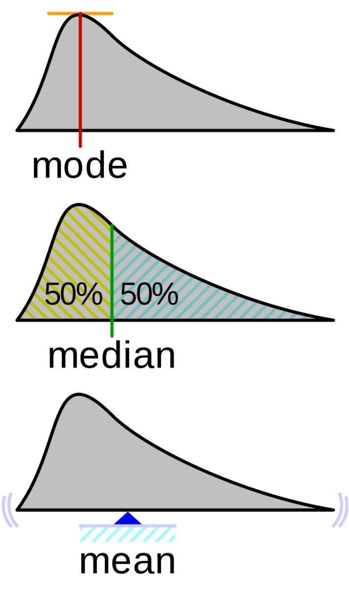

[wikipedia.org]: https://en.wikipedia.org/wiki/Probability_density_function


----------------------------------------------------------------

## notebook time
### we return to the lecture later


----------------------------------------------------------------

## Histograms

- The more data points we have, the more the histogram will look like the true distribution      
- Top to bottom: 20, 2,000, 20,000 samples drawn from a left-skewed distribution     
- The blue line can be thought as an estimate of the "true distribution"    

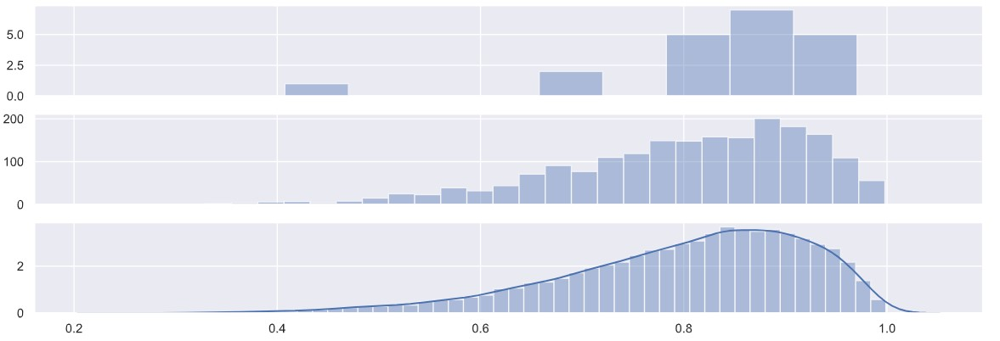

----------------------------------------------------------------

## Intrepreting a Box Plot


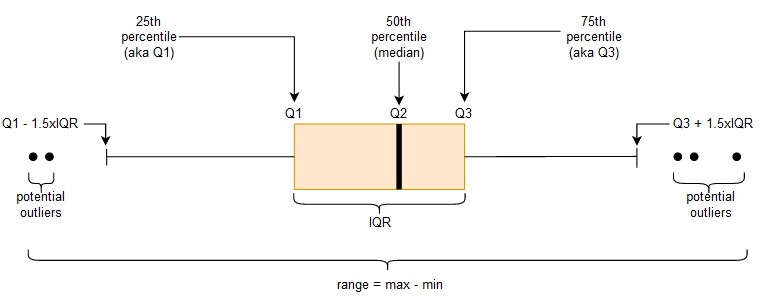

----------------------------------------------------------------

## Percentiles

- Let $p$ be a number between 0 and 1 (or between 0 and 100 if expressed as a percentage), so $p = 0.25$ or $p = 25\%$     
- The $p$th percentile data points $x_1, \ldots, x_n$ is some number $\tilde x_p$ so that $p$ percent of data points are less than this number, i.e. $1-p$ percentage of the data points are greater than this number     
- To get percentiles we need to **sort the data** in ascending order first     
- Sorting the data is not always practical for large datasets, and **approximate methods** are available     

----------------------------------------------------------------

## Percentiles and Ranks

- You can think of percentiles as **normalized ranks**     
- Smallest $x_i$ has rank 0, and it is the $0$th percentile    
- Largest $x_i$ has rank n, and it is the $100$th percentile    
- Median has rank approx. $n/2$, and it is the $50$th percentile    
- $25$th and $75$th percentiles are also known as $Q1$ and $Q3$ **quartiles**    
- $5$th and $95$th percentiles, or $1$st and $99$th percentiles can be good cut-offs for **outliers** (but this is usually subjective and depends on the data)    

----------------------------------------------------------------

## Discussion

You have a data set of patient hospitalization length (in terms of number of days)     

- Minimum hospitalization length is 0 days    
- $20$th percentile is 1 day    
- $40$th percentile is 1 day as well    
- $95$th percentile is 3.5 days    

What does this tell you about the data?    
Do you expect the data to contain outliers?    

----------------------------------------------------------------

## Box Plots

- Box plots don't convey as much information as histograms, but they come close    
- Top to bottom: 20, 2,000, 20,000 samples drawn from a left-skewed distribution    
- Box plots are more helpful for detecting outliers or comparing groups    

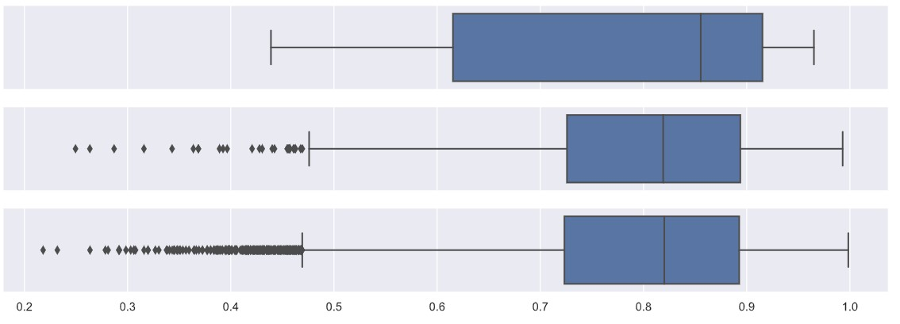

----------------------------------------------------------------

## Box Plots vs Density Plots

- Look at the **standard normal distribution** (with mean 0 and standard deviation 1)   
- Top distribution lines up with the box plot     
- Bottom distribution lines up with moving one standard deviation away from the mean    
- Image source: [wikipedia.org]     

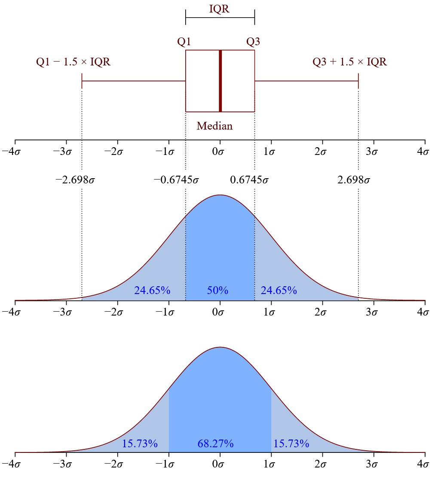

[wikipedia.org]: https://en.wikipedia.org/wiki/Probability_density_function

----------------------------------------------------------------

## qq plot

- Compares observed percentiles to theoretical percentiles (assuming a specific distribution)    
- If observed and theoretical values are very close (follow 45 degree line), then the distributions are very close    
- In this plot, we use the **normal distribution** for the theoretical distribution    

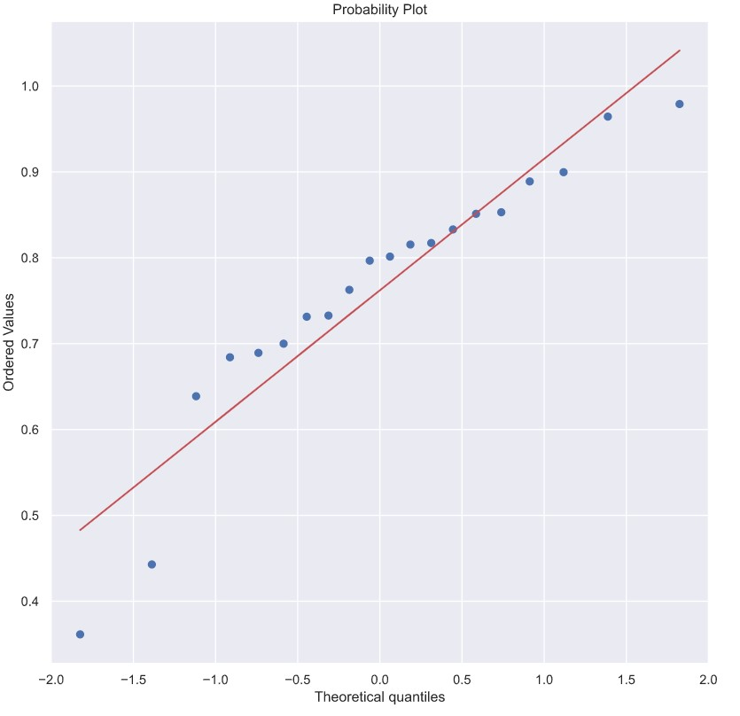

----------------------------------------------------------------

## Example: Bell-Shaped Distribution

mean = 0.48     
standard deviation = 0.13    
skewness = 0.02     
kurtosis = -0.45    

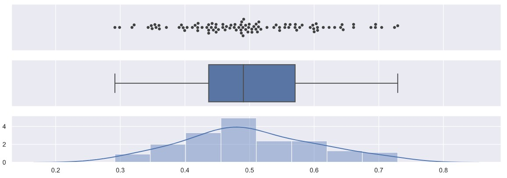

----------------------------------------------------------------

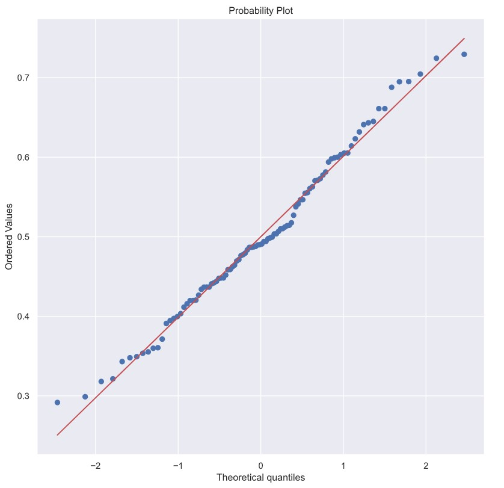

----------------------------------------------------------------

## Example: Right-Skewed Distribution

mean = 0.11    
standard deviation = 0.11     
skewness = 1.36    
kurtosis = 1.19    

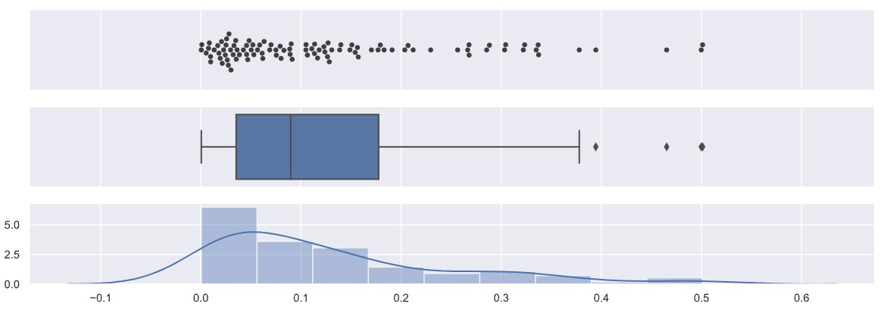

----------------------------------------------------------------

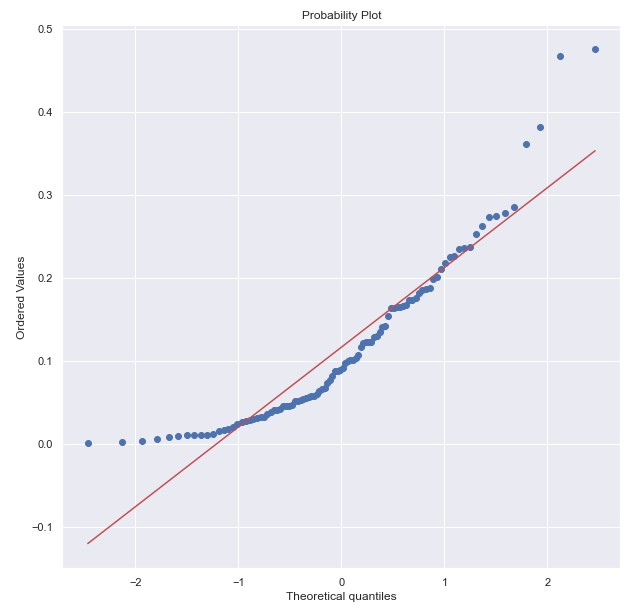

----------------------------------------------------------------

## Example: Left-Skewed Distribution

mean = 0.88    
standard deviation = 0.11     
skewness = -1.34    
kurtosis = 1.87     

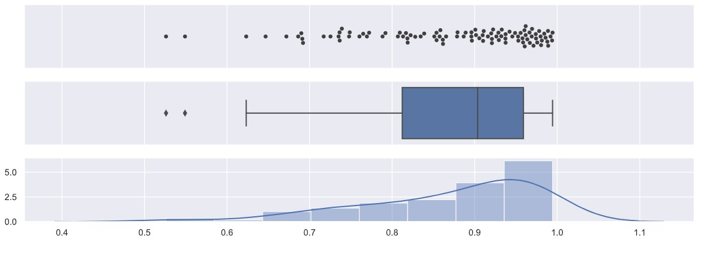

----------------------------------------------------------------

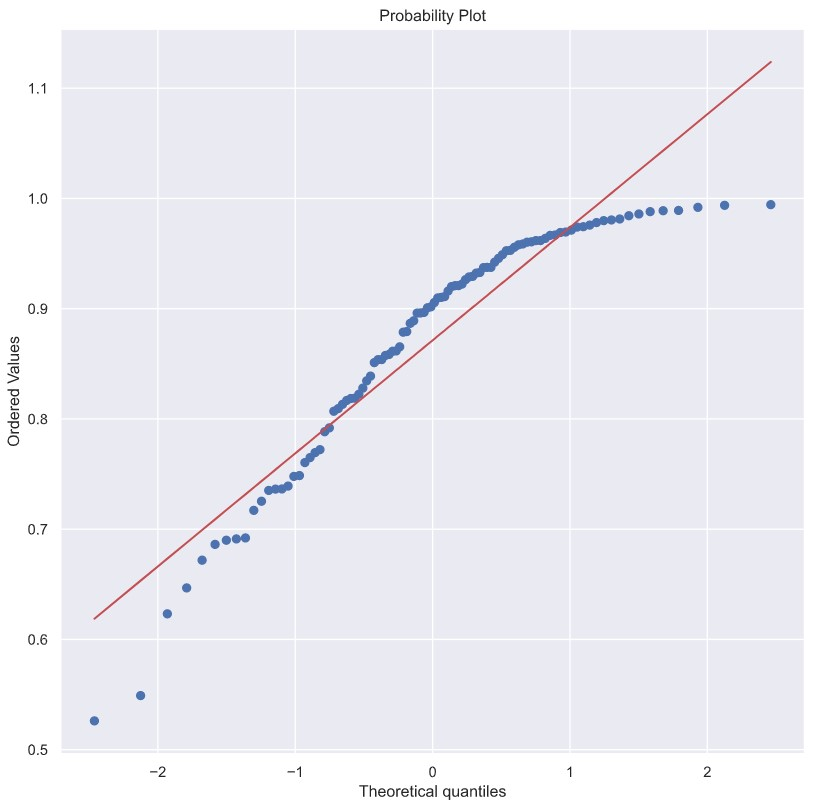

----------------------------------------------------------------

## Example: Bimodal Distribution

mean = 0.46     
standard deviation = 0.36    
skewness = 0.17    
kurtosis = -1.45    

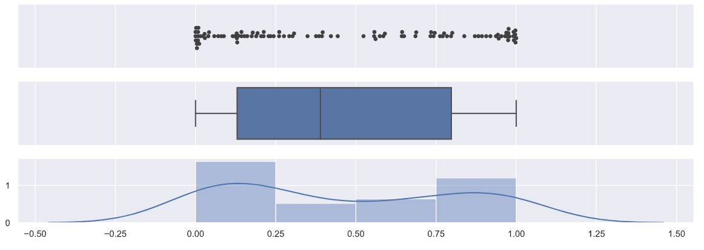

----------------------------------------------------------------

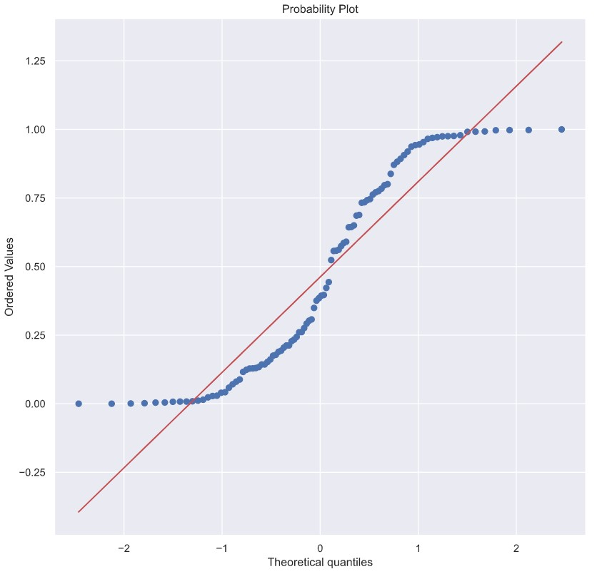

----------------------------------------------------------------

## Notebook Time


----------------------------------------------------------------

## The End!

<!-- 
from scipy import stats
import seaborn as sns
from matplotlib import pyplot as plt
import pandas as pd
import numpy as np
import seaborn as sns

sns.set(rc = {'figure.figsize': (10, 4)})
x = np.random.beta(8, 1, size = 20)
print('mean = {:.2f}'.format(np.mean(x)))
print('standard deviation = {:.2f}'.format(np.std(x)))
print('skewness = {:.2f}'.format(stats.skew(x)))
print('kurtosis = {:.2f}'.format(stats.kurtosis(x)))

f, axes = plt.subplots(3, sharex = True, figsize = (15, 5))
sns.swarmplot(x, color = ".25", ax = axes[0])
sns.boxplot(x, ax = axes[1])
sns.distplot(x, ax = axes[2])
 -->

<!-- 
f, axes = plt.subplots(3, sharex = True, figsize = (15, 5))
x = np.random.beta(8, 2, size = 20)
sns.distplot(x, kde = False, ax = axes[0], label = '20', norm_hist = True)
x = np.random.beta(8, 2, size = 2000)
sns.distplot(x, kde = False, ax = axes[1], label = '2000', norm_hist = True)
x = np.random.beta(8, 2, size = 20000)
sns.distplot(x, kde = True, ax = axes[2], label = '20000', norm_hist = True)
 -->

<!-- 
sns.set(rc = {'figure.figsize': (10, 10)})
stats.probplot(x, plot = sns.mpl.pyplot); 
 -->
