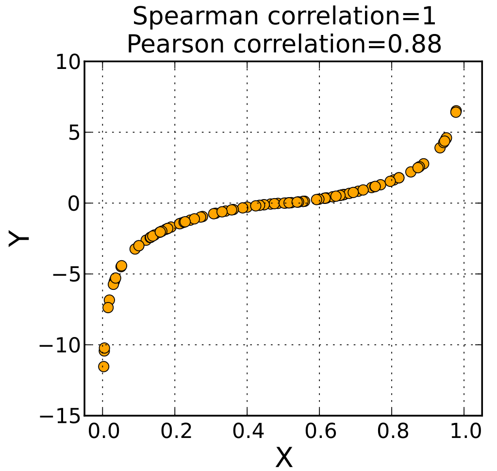

```{r setup, include=FALSE}
knitr::opts_chunk$set(echo = TRUE)
library(reticulate)
use_python("/usr/bin/python3")
matplotlib <- import("matplotlib")
matplotlib$use("Agg", force = TRUE)
#knitr::knit_engines$set(python = reticulate::eng_python)
```

------------------------------------------------

## Soving Data Science Coding Problems

Correctly using programming environments is a core data science skill; Python, R, SQL,.....      

- Read the documentation!    
  - Package documentation should be your first stop      
  - Do you know what all the arguments do?     
  - Are there examples/User Guides?      
  
- Search for answers online     
  - Search package Wiki      
  - Search reliable third party sources - e.g. StackOverflow    
  - Chances are some package nija has already answered the question you have    
  
- Trial and error    
  - Sometimes you just have to test several possibilities   
  - Work with the smallest unit of code to reproduce the problem   
  - Use a small subset of the data - check types and formats
  - Try a symbolic debugger


------------------------------------------------

## Effective Visualization for Exploration and Communications  

Visualization is primarily a form of communications    

- To be effective, visualization must be:      
  - Clear     
  - Well Organized     
  - Simple    
  
- Creating effective visualization is difficult     
  - Requires significant effort    
  - Try lots of ideas, fail fast, keep successful results    

----------------------------------------------------------------

## Visualizing Large Complex Data is Difficult  


**Problem:** Modern data sets are growing in size and complexity     

- **Goal:** Understand key relationships in large complex data sets     

- **Difficulty:** Large data volume   
  - Modern computational systems have massive capacity     
  - Example: Use map-reduce algorithms on cloud clusters
  
- **Difficulty:** Large numbers of variables
  - Huge number of variables with many potential relationships   
  - **This is the hard part!**

----------------------------------------

## Limitation Scientific Graphics  


All scientific graphics are limited to a **2-dimensional projection**    

- But, complex data sets have a great many dimensions     

- We need methods to project large complex data onto 2-dimensions    

- Generally, multiple views are required to understand complex data sets   
  - Don't expect one view to show all important relationships   
  - Develop understanding over many views    
  - Try many views, don't expect most to be very useful    

--------------------------------------

## Why is Perception Important?  

- **Goal:** Communicate information visually   

- Visualization technique maximize the information a viewer perceives     

- Limits of human perception are a significant factor in understanding complex relationships    

- Can apply results of the considerable research on human perceptions for data visualization    

------------------------------------

## Use Aesthetics to Improve Perception 

- We explore aesthetics to improve perception     

- We take a very broad view of the term 'aesthetic' here      

- A plot aesthetics is any property of a visualization which highlight aspects of the data relationships    

- Aesthetics are used to project additional dimensions of complex data onto the 2-dimensional plot surface    

---------------------------------------

## Over-plotting   

**Over-plotting** occurs in  plots when the markers lie one on another. 

- Common, even in relatively small data sets   
- Scatter plots can look like a blob and be completely uninterpretable     
- Over-plotting is a significant problem in EDA and presentation graphics    

--------------------------------------------

## Dealing with Over-plotting

What can we do about over-plotting?      

- **Marker transparency:** so one can see markers underneath; useful in cases with minimal overlap of markers   

- **Marker size:** smaller marker size reduces over-plotting within limits        

- **Adding jitter:** adding a bit of random **jitter** to variables with limited number of values   
- **Down sample:** visualize a subset of the full data

-------------------------------------------

## Example of Overplotting   

```{python, echo=FALSE}
from sklearn.datasets import load_diabetes
import pandas as pd
import numpy as np
import numpy.random as nr
import datetime
from math import log
import statsmodels.api as sm
import seaborn as sns
import matplotlib.pyplot as plt
from statsmodels.graphics import mosaicplot
import calendar

housing = pd.read_csv('../data/housing.csv')

## Create a datetime type column and a decimal year column
def date_to_decimal(x,frac=1.0/12.0):
    return x.year + frac * x.month
housing.loc[:,'time'] = pd.to_datetime(housing.loc[:,'time'])
housing.loc[:,'time_decimal'] = housing.loc[:,'time'].map(date_to_decimal)
    
## Fill the missing median sold price with listing price
medSoldMissing = housing.loc[:,'medSoldPriceSqft'].isnull()
housing.loc[medSoldMissing,'medSoldPriceSqft'] = housing.loc[medSoldMissing,'medListPriceSqft']

## Remove the remaining rows with missing median sold price values
medSoldNotMissing = housing.loc[:,'medSoldPriceSqft'].notnull()
housing = housing.loc[medSoldNotMissing,:]

## Filter median price sold
housing = housing.loc[(housing.loc[:,'medSoldPriceSqft'] < 500.0) & (housing.loc[:,'medSoldPriceSqft'] > 2.0),:]

## log transform price and see how this changes the plot
housing.loc[:,'log_medSoldPriceSqft'] = np.log(housing.loc[:,'medSoldPriceSqft'])

housing_reduced = housing.sample(frac=0.2, axis=0)
fig, ax = plt.subplots(figsize=(5, 3))
ax = sns.scatterplot(x='time_decimal', y='log_medSoldPriceSqft', data=housing_reduced, ax=ax)
_=ax.set_xlabel('Time', fontsize=14)
_=ax.set_ylabel('Log Median Sale Price', fontsize=14)
_=ax.set_title('Log median sale prices vs. time', fontsize=14)
plt.show()
```

---------------------------------------------

## Use Transparency, Marker Size, Downsampling

```{python, echo=FALSE}
fig, ax = plt.subplots(figsize=(5, 3))
ax = sns.scatterplot(x='time_decimal', y='log_medSoldPriceSqft', 
                      data=housing_reduced, alpha=0.1, s=2, ax=ax)
_=ax.set_xlabel('Time', fontsize=14)
_=ax.set_ylabel('Log Median Sale Price', fontsize=14)
_=ax.set_title('Log median sale prices vs. time', fontsize=14)
plt.show()
```


-----------------------------------------------------

## Alternatives to avoid over-plotting for truly large data sets 

- **Hex bin plots:** the 2-dimensional equivalent of the histogram     
  - Frequency of values is tabulated into 2-dimensional hexagonal bins   
  - Displayed using a sequential color palette    
  
- **2-d kernel density estimation plots:** natural extension of the 1-dimensional KDE plot   
  - Good for moderately large data    
  
- **Heat map:** values of one variable against another     
  - Categorical (count) or continuous variables    
  - Carefully choose color pallet, sequential or divergent   
  
- **Mosaic plots:** display multidimensional count (categorical) data   
  - Uses tile size and color to project multiple dimensions   
  - 2-d equivalent of a multi-variate bar chart       

 
--------------------------------------

## Hexbin Plot   

```{python, echo=FALSE}
p = plt.hexbin(housing.loc[:,'time_decimal'], housing.loc[:,'log_medSoldPriceSqft'], gridsize = 50, cmap='YlGnBu')
cb = plt.colorbar(p)
_=cb.set_label('Number of samples')
_=plt.xlabel('Time')
_=plt.ylabel('Log Median Sale Price')
_=plt.title('Log median sale prices vs. time')
plt.show()
```
 
---------------------------------------

## Countour Plot

```{python, echo=FALSE}
_=plt.hexbin(housing.loc[:,'time_decimal'], housing.loc[:,'log_medSoldPriceSqft'], cmap='YlGnBu')
###### Replace above with below ############################
#_=sns.jointplot(x='time_decimal', y='log_medSoldPriceSqft', data=housing, kind='kde')
_=plt.xlabel('Time', fontsize=14)
_=plt.ylabel('Log Median Sale Price', fontsize=14)
_=plt.title('Log median sale prices vs. time', fontsize=14)
plt.show()
```
 

----------------------------------------------

## Other Methods to Display Large Data Sets

Sometimes a **creative alternative** is best
  
- Often situation specific; many possibilities    

- Finding a good one can require significant creativity!    

- Example, choropleth for mutli=dimensional geographic data   

- Example, time series of box plots      


-------------------------------------------

## Time Series of Box Plots

```{python, echo=FALSE}
bins = [2008.0 + i * 0.25 for i in range(34)]
housing.loc[:,'time_bins'] = pd.cut(housing.loc[:,'time_decimal'], bins=bins)
fig, ax = plt.subplots(figsize=(5, 5))  
fig.subplots_adjust(bottom=0.4)
_=sns.boxenplot('time_bins', 'log_medSoldPriceSqft', color='lightgray', data=housing)
_=ax.set_xticklabels(ax.get_xticklabels(), rotation=90, fontsize=6)
_=ax.set_xlabel('Time', fontsize=6)
_=ax.set_ylabel('Log Median Sale Price', fontsize=8)
```


----------------------------------------------------------------

## bivariate measures

- **Pearson's correlation** looks for a **linear** relationship
- **Spearman's rank correlation** is Pearson's correlation applied to **ranks** (min = rank 1, max = rank $n$) 

- image source: [wikipedia.com]



[wikipedia.com]: https://en.wikipedia.org/wiki/Spearman%27s_rank_correlation_coefficient

----------------------------------------------------------------

## joint plots

- this is what a 2D density plot looks like, similar to a heatmap or contour plot
- we can also imagine a 2D histogram, but visually it's not practical
- they can resemble theoretical distributions, like the **bivariate normal distribution**
- image source: [seaborn.pydata.org/]


[seaborn.pydata.org/]: https://seaborn.pydata.org/examples/joint_kde.html

----------------------------------------------------------------

## higher dimensional data

In higher dimensions, things get more challenging, but still manageable **up to a certain point** (usually 5 or so dimensions)          
- we can use **aesthetics** to add additional dimensions to visualizations, but we quickly run out of elements        
- we can use **faceting** to break up a plot into many, but having too many plots to look at can be overwhelming         

As dimensionality goes up, we need to rely on more advanced methods, but as we learn later there's no such thing as a free lunch       
- run a ML algorithms for **dimensionality reduction**        
- use visualizations such as t-SNEs meant to deal with such situations         

----------------------------------

## Organization of Plot Aesthetics

We can organize aesthetics by their effectiveness:   

1. **Easy to perceive plot aesthetics:** help most people gain understanding of data relationships    

2. **Aesthetics with moderate perceptive power:** useful properties to project data relationships when used sparingly         

3. **Aesthetics with limited perceptive power:** useful within strict limits   

------------------------------

## Properties of Common Aesthetics

| Property or Aesthetic |Perception| Data Types |
|:---------|:-----------|:------------|
|Aspect ratio | Good | Numeric |
|Regression lines | Good | Numeric plus categorical |
|Marker position | Good | Numeric |
|Bar length | Good | Counts, numeric |
|Sequential color palette | Moderate | Numeric, ordered categorical |
|Marker size | Moderate | Numeric, ordered categorical |
|Line types | Limited | Categorical |
|Qualitative color palette | Limited | Categorical|
| Marker shape | Limited | Categorical |
| Area | Limited | Numeric or categorical |
| Angle | Limited | Numeric |


----------------------------------------------------------------

## using aesthetics

- how many dimensions are represented in this plot?
- be careful not to overdo it with aesthetics
- image source: [seaborn.pydata.org/]


[seaborn.pydata.org/]: https://seaborn.pydata.org/examples/scatter_bubbles.html


----------------------------------------------------------------

## using facet plots

- how many dimensions are represented in this plot?
- faceting is helpful when we have categorical data with a handful of categories
- keep the comparisons to a minimum otherwise you risk overplotting
- image source: [seaborn.pydata.org/]


[seaborn.pydata.org/]: https://seaborn.pydata.org/examples/logistic_regression.html


--------------------------------------------

## Facet Plot with Weather by Season

```{python, echo=FALSE}
bike_share_df = pd.read_csv('../data/BikeSharing.csv')

## Add month column with names
bike_share_df.loc[:,'month'] = [calendar.month_abbr[i] for i in bike_share_df.loc[:,'mnth']]

## Add column with human readable weather conditions
weather = {1:'Clear', 2:'Mist', 3:'Light precipitation', 4:'Heavy precipitation'}
bike_share_df.loc[:,'Weather'] = [weather[i] for i in bike_share_df.loc[:,'weathersit']]

season = {1:'winter', 2:'spring', 3:'summer', 4:'fall'}
bike_share_df.loc[:,'Season'] = [season[i] for i in bike_share_df.loc[:,'season']]
year = {0:'2011', 1:'2012'}
bike_share_df.loc[:,'year'] = [year[i] for i in bike_share_df.loc[:,'yr']]
working = {0:'No_Work', 1:'Working'}
bike_share_df.loc[:,'WorkingDay'] = [working[i] for i in bike_share_df.loc[:,'workingday']]

with sns.plotting_context(font_scale=0.25):
    g = sns.FacetGrid(bike_share_df, col="Weather", col_order=weather.values(), row="month", row_order=calendar.month_abbr[1:], height=1.0, aspect=1.5)
    g = g.map(plt.scatter, "hr", "cnt", alpha=0.2, s=1)
    plt.show()
```


----------------------------------------------------------------

## correlation matrix

- this is a visualization of the correlation matrix as a heatmap
- it can be used to see which variables are correlated with which others
- image source: [seaborn.pydata.org/]


[seaborn.pydata.org/]: https://seaborn.pydata.org/examples/many_pairwise_correlations.html

----------------------------------------------------------------

## scatter plot matrix

- this is the scatter plot version of the correlation matrix
- color-coding can be used to add a 3rd dimension
- image source: [seaborn.pydata.org/]


[seaborn.pydata.org/]: https://seaborn.pydata.org/examples/scatterplot_matrix.html

----------------------------------------------------------------

## [notebook time]
### we return to the lecture later

----------------------------------------------------------------

## Spurious correlations

- image source: [tylervigen.com]


[tylervigen.com]: https://www.tylervigen.com/spurious-correlations

----------------------------------------------------------------

## Simpson's paradox

Simpson's paradox gives rise to false associations      

- A trend appears to have one trend      
- But another trend when data is grouped by another variable    

- image source: [wikipedia.com]


[wikipedia.com]: https://en.wikipedia.org/wiki/Simpson%27s_paradox

----------------------------------------------------------------

## Simpson's paradox

Simpson's paradox arises from a **latent variable**   

- Latent variable is 'hidden'    
  - Not considered in an analysis    
  - Unobservable or data is unavailable   
  
- Examples of unobservatble data     
  - Someone's intention; only observe actions or responses      
  - The presence of a disease; only observe symptoms      
  - The temperature of the surgface of the sun; only observe spectra


----------------------------------------------------------------

## Simpson's paradox     

With categorical data, Simpson's paradox can occur when the relative size of the groups is different between the control and treatment

- image source: [theconversation.com]


[theconversation.com]: https://theconversation.com/paradoxes-of-probability-and-other-statistical-strangeness-74440

----------------------------------------------------------------

## Anscombe's quartet

- $x$ and $y$ in the four data sets have the same **mean**, **variance**, **correlation** and **trend line** $y = a + bx$ if we use linear regression to find $a$ and $b$

- image source: [wikipedia.com]


[wikipedia.com]: https://en.wikipedia.org/wiki/Anscombe%27s_quartet

----------------------------------------------------------------

## the end
