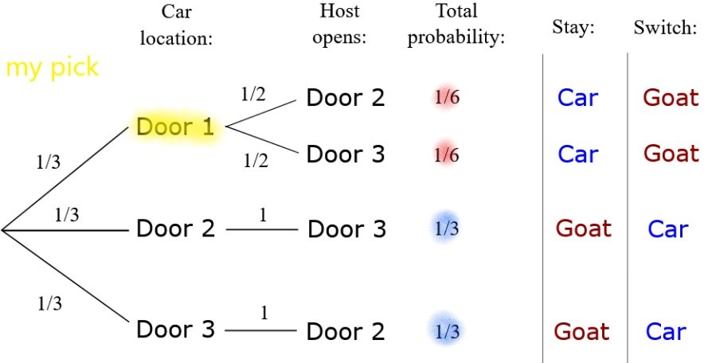

```{r setup, include=FALSE}
knitr::opts_chunk$set(echo = TRUE)
library(reticulate)
use_python("/usr/bin/python3")
matplotlib <- import("matplotlib")
matplotlib$use("Agg", force = TRUE)
#knitr::knit_engines$set(python = reticulate::eng_python)
```


--------------------------------------------------------------

## Introduction to Probability Theory     

Probability theory is the mathematical basis of statistics, machine learning and much of artificial intelligence  

- Statistical and machine learning methods are largely applications of probability theory to samples    


- Probability theory is still an active area of research    

  
```{r Brenoulli, out.width = '25%', fig.cap='Jacob Bernoulli, probability pioneer\n Credit, Wikipedia commons', fig.align='center', echo=FALSE}
knitr::include_graphics(rep("../images/Bernoulli.jpg"))
```

--------------------------------------------------------------

## Introduction to Probability Theory     

Probability theory is the mathematical basis of statistics, machine learning and much of artificial intelligence  


- Probability theory has a long history       
  - Jacob Bernoulli (1654, 1705), a Swiss mathematician, pioneered the mathematical theory of probability.    
  - Bernoulli's book *Artis conjectandi* was published postumously in 1713
  
```{r Brenoulli_Book, out.width = '25%', fig.cap='First probability textbook\n Credit, Wikipedia commons', fig.align='center', echo=FALSE}
knitr::include_graphics(rep("../images/Ars.jpg"))
```

   

----------------------------------------------------------------

## Outline

- Discrete vs continuous random variables   

- Understand the 3 axioms of probability   

- Applications of combinatorics to probability theory    

- Conditional, mutually exclusive, and independent events   


----------------------------------------------------------------

## Probability Distributions  

**Probability distributions** are models for uncertainty of **random variables**     

- A random variable is any **mapping**, $X$, from from some outcome of a random event, $\omega$, to a real number, $\mathbb{R}$:

$$X(\omega) \rightarrow \mathbb{R}$$

- **Example:** The mapping can be a count   

- **Example:** A function which transforms $\omega$ to a real number, $\mathbb{R}$   

- This concept appears abstract at first glance, but is fundamental to the theory of probability    
- We will see many examples in this course
      
  
  
-----------------------------------------------

## Two Types of Probability Distributions   

- **Discrete**   
  - Model countable events     
  - Examples; people making a purchase, number of patients with disease,....
  - Characterized by a **probability mass function (PMF)**  

- **Continuous**    
  - Examples; temperature, velocity, price,.......
  - Characterized by a **probability density function (PDF)**  

----------------------------------------------------------------

## Discrete vs Continuous Random Variables

|   | discrete | continuous |
|---|-----------------|---------------|
| sample space | counted | measured |
| math | summation | integration |
| $P(A)$ | probability mass function\n\n $\\P(A) = \sum_{a \in A} P(A = a)$ | probability density function\n\n $\\P(A) = \int_{a \in A} P(A)\ dA$ |
| examples | dice roll, number of arrivals, etc. | price, height, distance |
| visualizations | bar plot, n-way tables, ... | histograms, box plots, ... |

  
-----------------------------------------------

## Example: the Uniform Distribution

- the **discrete uniform distribution** is used to model discrete outcomes when those outcomes are equally likely    

- Computationally, other distributions are generated by draws from the uniform distribution   

- the **continuous uniform distribution** is used to model continuous outcomes when any intervals of equal length (measure) are equally likely

- image source: [wikipedia.org]


```{r Uniform, out.width = '25%', fig.cap='Discrete and continuous uniform distribution', fig.align='center', echo=FALSE}
knitr::include_graphics(rep("../images/uniform-discrete-vs-continuous.jpg"))
```


----------------------------------------------------------------

## Probability Mass Function

- $S$ is a discrete **random variable**
- Represents the sum of two independent dice rolls
- In general, $S$ can be finite or infinite

```{r dice, out.width = '50%', fig.cap='Probablities for dice sum', fig.align='center', echo=FALSE}
knitr::include_graphics(rep("../images//probability-mass-function.jpg"))
```


[wikipedia.org]: https://en.wikipedia.org/wiki/Probability_distribution


------------------------------------------------

## Normal distribution

The **Normal distribution** or **Gaussian distribution** is one of the most widely used probability distributions

- The distribution of mean estimates of observations of a random variable drawn from any distribution converge to a Normal distribution by the **central limit theorem (CLT)**   

- Many physical processes produce Normal measurement values    

- Normal distribution has tractable mathematical properties   

----------------------------------------------------------------

## Probability density function - Normal Distribution

- $S$ is a continuous variable
- Example: $S$ follows the **standard normal distribution** (mean 0 and standard deviation 1)
- For normal distribution, show proportion of the data that are 1, 2, and 3 standard deviations from the mean (known as the "68-95-99 rule")

- image source: [wikipedia.org]


```{r normal, out.width = '50%', fig.cap='Normal density function', fig.align='center', echo=FALSE}
knitr::include_graphics(rep("../images/probability-density-function.jpg"))
```

[wikipedia.org]: https://en.wikipedia.org/wiki/Probability_distribution


------------------------------------------------

## Probability Density Function - Normal distribution    

For a univariate Normal distribution we can write the **probability density function** as:

$$P(x) = \frac{1}{\sqrt{2 \pi \sigma^2}} \exp{\frac{-(x - \mu)^2}{2 \sigma^2}}$$

The parameters can be interpreted as:

\begin{align}   
\mu &= location\ parameter = mean \\
\sigma &= scale = standard\ deviation \\
\sigma^2 &= Variance 
\end{align}

Normal distribution is an example of a **parametric distribution**

------------------------------------

## Axioms of Probability   

From these three axioms we can draw some useful conclusions     

- Events which cannot occur have probability 0     

- Events that must occur have probability 1    

- Events must have a probability mass function between 0 and 1 

-----------------------------------------

## Axioms of Probability         

For discrete distributions, we can speak of a **set of events** within the **sample space** of all possible events       


1. Probability for any set of events, A, is greater than 0 and less than or equal to 1    

$$0 \le P(A) \le 1 $$


2. The sum of the probability mass functions over the sample space must add to 1

$$P(S) = \sum_{a_i \in A}P(a_i) = 1 $$


3. If sets of events A and B are mutually exclusive, then the probability of either A and B is the probability of A plus the probability of B

$$P(A\ \cup B) = P(A) + P(B)\\ if\ A \perp B$$

    

----------------------------------------------------------------------

## Axioms of probability for continuous distributions

**Axioms of probability** for continuous probability density function, $f(x)$

1. On the interval, $\{ x_1, x_2 \}$, $P(x)$, must be bounded by 0 and 1:

$$0 \le \int_{x_1}^{x_2} f(x) dx\ \le 1$$

Note: if $x_1 = x_2$ the integral is 0

2. The area under the entire PDF over the limits must be equal to 1:   

$$\int_{lower}^{upper} f(x) dx = 1$$    

Note: many distributions lower = $0$ or $-\infty$ and upper = $\infty$

3. If events A and B are mutually exclusive:

$$P(A\ \cup B) = P(A) + P(B)\ \\ if\ A \perp B$$


--------------------------------------------------------

## Combinatorics

Combinatorics in the most active area of applied math    

- More papers published     

- Basis of much of computer science, searching, graph theory, etc.    

- Basis of discrete probability theory       


-----------------------------------------------------------

## Combinations vs Permutations    

**Combination** are based on choosing k items from from n choices    
- **Order does not mater**    
- Use the **multiplication principle**   


**Permutations** are the number of sequences of length k from n choices    
- **Order maters**    
- Changing order creates a new permutation    


--------------------------------------------------

## Combinations and the Multiplication Principle 

How many unique combinations of k items can we make from n choices? 

- Example: how many possible unique sandwiches can we order from once choice each of: 4 bread choices, 5 meat choices, 4 toppings.     
- Order does not matter, just multiply:  

$$4∗5∗4=80$$

-----------------------------------------

## Purmutations and Factorials    

You can create a new unique permutation by reordering your choices   

- Example, how many ways can you order 5 books on a shelf?   

- We can multiply the choices:    

$$5 * 4 * 3 * 2 * 1 = 120$$   

- This is where **factorials** arise:    

$$n! = 5! = 120$$ 

In general, we can order $n$ items into $n!$ permutations    

----------------------------

## Combinations and Factorials   

The general approach to computing the possible combinations of $k$ items from $n$ choices uses the **Binomial coefficient**    

- Express the Binomial coefficient as **n choose k**:   

$$\binom{N}{k} = \frac{N!}{k!(N - k)!}$$

- Example: how many different combinations of 4 items can you create from 10 choices?    

$$\binom{10}{4} = \frac{10!}{4!(10 - 4)!} = 210$$

----------------------------

## Combinations and Factorials   

Since order matters, get **large numbers of permutations!**

- Compute the number of **possible permutations** as:

$$\frac{N!}{(N - k)!}$$

- *Example:* A student can take 1 course at a time from 10 possibilities. Assuming no prerequisites how many permutations of 4 courses can the student take:

$$10 * 9 * 8 * 7 = \frac{10!}{(10 - 4)!} = 5040$$


---------------------------------------------------

## Permutation Tests   

Permutation tests are a type of statistical hypothesis test    

- **A two sample Statistical hypothesis test** determines if a difference in two samples is **statistically significance**      

- We say the **null hypothesis** is there is no significant difference   

**Don't panic!** We will revisit the concepts of hypothesis tests. 


---------------------------------------------------

## Permutation Tests    

**Permutation tests** are an **exact hypothesis test**, or **nonparametric hypothesis test**   

- Start with two samples, $X$ and $Y$: $\{x_1, x_2, \ldots, x_n; y_1, y_2, \ldots, y_m \}$     

- Compute a statistic; e.g.$S_0 = | \bar{X} - \bar{Y} |$ is the **null hypothesis**    

- Find $B$ permutations of samples; e.g. $\{ X^*, Y^* \} =\{x_1, y_2, \ldots, x_n; y_1, x_2, \ldots, y_m \}$     

- For each permutation compute the statistic; $S_i^* = | \bar{X}_i^* - \bar{Y}_i^* |$  

- The probability of the average  

$$P(S^* > S_0) = \frac{1}{B} \sum_{i=1}^B I(S_i^* > S_0)$$    
- If there is no difference, $P(S^* > S_0) = 0.5$, half the values should fall around the null value   


----------------------------------------------------------

# Notebook Time! 


----------------------------------------------------------------

## Joint Probability Distributions

- Many probability problems involve multiple variables; sometimes a great number    

- if you have two random variables $A$ and $B$, then $P(A \text{ and } B)$ is the **joint probability** of $A$ and $B$, which we write as $P(A, B)$    

- **Discrete example:** $A = \{\text{sunny day, rainy day}\}$ and $B = \{\text{number of museum visitors on a day}\}$, then we can ask for example is $P(A = \text{sunny day and } B = 10)$     

- **continuous example:** $A = \{\text{height (cm)}\}$ and $B = \{\text{weight (kg)}\}$, then we can ask $P(A > 150 \text{ and } B < 50)$       

------------------------------------------------

## Multivariate Normal

Many practical applications have an $n$-dimensional parameter vector in $\mathbb{R}^n$, requiring **multivariate distributions**     

- **Multivariate Normal distribution**, parameterized by:  
- **n-dimensional vector of locations**, $\vec{\mathbf{\mu}}$  
  - The vector(multi) valued version of univariate location
- $n$ x $n$ dimensional **covariance matrix**, $\mathbf{\Sigma}$   
  - The multi-dimensional version of univariate variance $\sigma^2$

$$f(\vec{\mathbf{x}}) = \frac{1}{{\sqrt{(2 \pi)^n |\mathbf{\Sigma}|}}}exp \big(\frac{1}{2} (\vec{\mathbf{x}} - \vec{\mathbf{\mu}})^T \mathbf{\Sigma} (\vec{\mathbf{x}} - \vec{\mathbf{\mu}})\big)$$      

- $|\mathbf{\Sigma}|$ is the determinant of the covariance matrix. 

- Along the diagonal the values are the $n$ variances of each dimension, $\sigma_{i,i}$    

- Off-diagonal terms describe the **dependency** between the $n$ dimensions of the distribution. 

------------------------------------------------

## Multivariate Normal

We can write the covariance matrix:  

$$
\mathbf{\Sigma} = 
\begin{bmatrix}
\sigma_{1,1} &  \sigma_{1,2} & \ldots & \sigma_{1,n} \\
\sigma_{2,1} &  \sigma_{2,2} & \ldots & \sigma_{2,n} \\
\vdots & \vdots & \vdots & \vdots \\
\sigma_{n,1} &  \sigma_{n,2} & \ldots & \sigma_{n,n} \\   
\end{bmatrix} 
$$

For a Normally distributed n-dimensional multivariate random variable, $\sigma_{i,j}$ computed from the sample, $\mathbf{X}$:

\begin{align}
\sigma_{i,j} &= \mathrm{E} \big[ (\vec{x}_i - \mathrm{E}[\vec{x}_i]) \cdot (\vec{x}_j - \mathrm{E}[\vec{x}_j]) \big] \\
&= \mathrm{E} \big[ (\vec{x}_i - \bar{x}_i) \cdot (\vec{x}_j - \bar{x}_j) \big] \\
&= \frac{1}{k}(\vec{x}_i - \bar{x}_i) \cdot (\vec{x}_j - \bar{x}_j)
\end{align}

Where $\cdot$ is the inner product operator and $\bar{x_i}$ is the mean of $\vec{x_i}$.

------------------------------------------------

## Multivariate Normal   

2-dimensional Normal with $\mu = [0,0]$ and $\sigma = \begin{bmatrix} 1.0 & 0.0 \\ 0.0 & 1.0 \end{bmatrix}$

```{python, echo=FALSE}
import pandas as pd
import numpy as np
import numpy.random as nr
import scipy.stats as ss
import seaborn as sns
import matplotlib.pyplot as plt
```

```{python, echo=FALSE}
def plot_bi_variate(x, title='1000 draws from a bivariate Normal distribution'):
    ## Plot bi-variable points
    fig, ax = plt.subplots(figsize=(3,3)) 
    plt.rcParams.update({'font.size':6})
    ax.scatter(x[:, 0], x[:, 1], alpha=.1)
    ax.set_xlim(-4.0,4.0)
    ax.set_ylim(-4.0,4.0)
    _=ax.set_title(title)
    plt.show()


## Define the covariance and mean of the bivariate Normal. 
sigma = np.array([[1,0.0], [0.0, 1]])
mu = np.array([0.0, 0.0])
## Sample 500 realizations from the bivariate Normal
random_points = nr.multivariate_normal(mean=mu, cov=sigma,  size=1000)

## Plot the result
plot_bi_variate(random_points)
```

------------------------------------------------

## Multivariate Normal   

2-dimensional Normal with $\mu = [0,0]$ and $\sigma = \begin{bmatrix} 1.0 & 0.0 \\ 0.0 & 0.5 \end{bmatrix}$

```{python, echo=FALSE}
## Define the covariance of the bivariate Normal. 
sigma = np.array([[1,0.0], [0.0, 0.5]])
## Sample 500 realizations from the bivariate Normal
random_points = nr.multivariate_normal(mean=mu, cov=sigma,  size=1000)

## Plot the result
plot_bi_variate(random_points)
```

------------------------------------------------

## Multivariate Normal   

2-dimensional Normal with $\mu = [0,0]$ and $\sigma = \begin{bmatrix} 1.0 & 0.5 \\ 0.5 & 1.0 \end{bmatrix}$

```{python, echo=FALSE}
## Define the covariance of the bivariate Normal. 
sigma = np.array([[1,0.5], [0.5, 1.0]])
## Sample 500 realizations from the bivariate Normal
random_points = nr.multivariate_normal(mean=mu, cov=sigma,  size=1000)

## Plot the result
plot_bi_variate(random_points)
```

------------------------------------------------

## Multivariate Normal   

2-dimensional Normal with $\mu = [0,0]$ and $\sigma = \begin{bmatrix} 1.0 & -0.5 \\ -0.5 & 1.0 \end{bmatrix}$

```{python, echo=FALSE}
## Define the covariance of the bivariate Normal. 
sigma = np.array([[1,-0.5], [-0.5, 1.0]])
## Sample 500 realizations from the bivariate Normal
random_points = nr.multivariate_normal(mean=mu, cov=sigma,  size=1000)

## Plot the result
plot_bi_variate(random_points)
```

------------------------------------------------

## Multivariate Normal   

2-dimensional Normal with $\mu = [0,0]$ and $\sigma = \begin{bmatrix} 1.0 & 0.9 \\ 0.9 & 1.0 \end{bmatrix}$

```{python, echo=FALSE}
## Define the covariance of the bivariate Normal. 
sigma = np.array([[1,0.9], [0.9, 1.0]])
## Sample 500 realizations from the bivariate Normal
random_points = nr.multivariate_normal(mean=mu, cov=sigma,  size=1000)

## Plot the result
plot_bi_variate(random_points)
```

----------------------------------------------------------------

## Conditional Probability

Many real-world random variables depend on other random variables    

- Statistical models of complex processes invariably require the use of **conditional probability distributions**     

- **Conditional probability** is the probability that event A occurs given that event B has occurred 
- Write the conditional probability of A given B as:    

$$P(A|B)$$

- **Example:** Model of the probability of contracting the infectious disease, depends on other variables
  - In more technical terms, the probability of contracting the disease is **conditional** on other random variables.   
  - Age, contact with people carrying the disease, immunity, etc. 


--------------------------------------------------

## Properties of Conditional Probability

Example: 

```{r ConditionalSets, out.width = '30%', fig.cap='Example of conditional probability of discrete events; credit, Wikipedia commons', fig.align='center', echo=FALSE}
knitr::include_graphics(rep("../images/Prob1.png"))
```

- **Sample space** is the space of all possible events in the set $S$     

- Sample space is divided into several **subspaces** or **subsets**, $A$, $B$ and $C$    

- **Intersection** is where the two sets overlap occur in both $A$ and $B$   


--------------------------------------------------

## Properties of Conditional Probability

Example: 

```{r ConditionalSets2, out.width = '20%', fig.cap='Example of conditional probability of discrete events; credit, Wikipedia commons', fig.align='center', echo=FALSE}
knitr::include_graphics(rep("../images/Prob1.png"))
```

- **Intersection** is where the two sets overlap occur in both $A$ and $B$    
  - First, find the relationship between conditional probability and the intersection between the sets, $P(A \cap B)$  
  - The probability of the intersection is the product of two probabilities:    
  1. $P(B)$ since B must be true to be in this intersection.    
  2. $P(A|B)$ since A must also occur when B is occurring
  - The result is:   

$$P(A \cap B) = P(A|B) P(B)$$


-------------------------------------------------

## Properties of Conditional Probability

$$P(A \cap B) = P(A|B) P(B)$$

Rearranging terms we get the following: 

\begin{align}
P(A|B) &= \frac{P(A \cap B)}{P(B)} \\
& = \frac{\frac{2}{10}}{\frac{4}{10}} = \frac{2}{4} = \frac{1}{2}
\end{align}

We could have, just as well, written the last equation as: 

$$P(B \cap A) = P(B|A)P(A)$$

Now, the probability of an identical event in the same intersection:   

$$P(A \cap B) = P(A|B) P(B) = P(B|A)P(A) = P(B \cap A)$$

**Factorization** of a probability function is a key tool: notice that the factorization of a conditional probability distribution in not unique  


----------------------------------------------------

## Set Operations and Probability

Set operations are applied to probability problems    

1. **Intersection:**   

$$P(A \cap B)  = P(A|B)P(B)$$

2. **Union:** is the sum of the probabilities of the sets minus the intersection between the sets:

$$P(A \cup B) = P(A) + P(B) - P(A \cap B)$$

3. **Negation:** Example, compute the probability of an event being in subset $A$ but not in $B$:   

$$P(A\ and\ \neg B) = P(A) - P(B \cap A)$$


**Example:** We can apply **[De Morgan's Laws](https://en.wikipedia.org/wiki/De_Morgan%27s_laws)**:

\begin{align}
P(\neg (A \cup B)) &= P(\neg A\ \cap \neg B)\\
P(\neg (A \cap B)) &= P(\neg A\ \cup \neg B)
\end{align}


--------------------------------------------------------

## Independence and Mutual Exclusivity

The factorization of probability distributions can be simplified if events are either **independent** or **mutually exclusive**    

- At first glance, these concepts may seem similar
  - Are quite different
  - Very different implications

- **Independence** of sets $A$ and $B$ means the occurrence of an event in $A$, does not have any dependency on an event in $B$   

- **Mutual exclusivity** means events cannot occur in both the sets $A$ and $B$

----------------------------------------------------------------

## Independet vs Mutually-Exclusive Events

Easy to confuse, but are quite different!    

- Two events $A_1$ and $A_2$ are said to be **mutually exclusive** if they cannot occur at the same time, where $A_1$ and $A_2$ are subsets of $A$    
  - We write $P(A_1 \cap A_2) = \emptyset$    
  - Consider it when comparing subsets of the sample space     
  
- Two events $A$ and $B$ are said to be **independent** if one happening does not affect the probability of the other happening    
  - We write $P(A | B) = P(A)$ and $P(B | A) = P(B)$     
  - Two events are independence, the joint probability is product of their marginal probabilities    
  - So, $P(A \cap B) = P(A) P(B)$          


-----------------------------------------

## Independence

Express independence of random variables, $A \perp B$, mathematically:   

\begin{align}
P(A\ \cap B) &= P(A|B)P(B) = P(A)P(B)\\ 
P(A\ \cup B) &= P(A) + P(B) - P(A)P(B)\\
P(A|B) &= P(A)\\
P(A| \neg B) &= P(A)
\end{align}
 
But independence of A given B does not imply independence of B given A:

$$P(A|B) = P(A) \nLeftrightarrow P(B|A) = P(B)$$

In other words, we need to pay attention to if A is independent of B or B is independent of A  
- One or the other could be true
- Both could be true


---------------------------------------------

## Mutual Exclusivity     

In general, for any two events $A$ and $B$ we have:
  $$P(A \cup B) = P(A) + P(B) - P(A \cap B)$$

If the intersection between events is an empty set:  

$$A \cap B = \emptyset$$     

Then, events in A are **mutually exclusive** of events in B:

\begin{align}
P(A \cup B) &= P(A) + P(B)\\
P(A|B) &= 0\\
P(A| \neg B) &= \frac{P(A)}{1 - P(B)}\\
P(\neg A) &= 1 - P(A)
\end{align}

And, $A$ mutually exclusive of B, implies B is mutually exclusive of A


----------------------------------------------------------------

## [notebook time]
### we return to the lecture later

----------------------------------------------------------------

## Monte Hall Problem

- Outcomes involving conditional probabilities can seem quite nonintuative!      

- you are presented with three doors: two have goats behind, one has a car behind   

- the host knows which door has a car behind it, but you don't    

- you select a door, then host would open one of the two other doors to reveal a goat    

- you have a choice between sticking with the door you selected, or switching to the other door the host didn't open     

- does it matter if you switch or not?    

----------------------------------------------------------------

## Monty Hall Problem

```{r Monte, out.width = '60%', fig.cap='The Monte Hall game', fig.align='center', echo=FALSE}
knitr::include_graphics(rep("../images/monte-hall-problem.jpg"))
```


[wikipedia.org]: https://en.wikipedia.org/wiki/Monty_Hall_problem

----------------------------------------------------------------



----------------------------------------------------------------

- let $C = \{1, 2, 3\}$ represent where the car is
- let $H = \{1, 2, 3\}$ represent the door opened by host
- **assume by symmetry that we pick door 1**, and compute conditionals probabilities:
  - note that $P(H = i | C = i) = 0$ for $i = 1, 2, 3$, because host cannot open door with car, also $P(H = 1 | C = 1) = 0$, which leaves us with $P(H = 2 | C = 1) = 0.5$ and $P(H = 3 | C = 1) = 0.5$
  - note that $P(H = 1 | C = i) = 0$ for $i = 1, 2, 3$ because host cannot not open the door we picked, leaving us with $P(H = 3 | C = 2) = 1$ and $P(H = 2 | C = 3) = 1$
- now we compute the joint probabilities $P(H \text{ and } C) = P(H|C)P(C)$
- finally, we add up joint probabilities for goat and car under switch scenario

----------------------------------------------------------------

## the end

