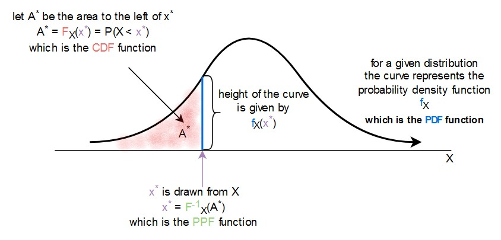

```{r setup, include=FALSE}
knitr::opts_chunk$set(echo = TRUE)
library(reticulate)
use_python("/usr/bin/python3")
matplotlib <- import("matplotlib")
matplotlib$use("Agg", force = TRUE)
#knitr::knit_engines$set(python = reticulate::eng_python)
```

------------------------------------------------------

## Importance of Probability Theory

- Probability theory is the basis of statistics, machine learning and much AI     

- An understanding of probability theory is an important foundation to understand these methods    

- In this lesson we will review some basic concepts    
  - Properties of probability distributions   
  - Some commonly used probability distributions - focus on difficult to understand properties   
  
- Many texts provide comprehensive introductions to probability theory   


----------------------------------------------------

## Set operations and probability

Set operations are applied to probability problems    

1. **Intersection:**   

$$P(A \cap B)  = P(A|B)P(B)$$

2. **Union:** Probability is the sum of the probabilities of the sets less the intersection between the sets:

$$P(A \cup B) = P(A) + P(B) - P(A \cap B)$$

3. **Negation:** Example, compute the probability of an event being in subset $A$ but not in $B$:   

$$P(A\ and\ \neg B) = P(A) - P(B \cap A)$$


**Example:** We can apply **[De Morgan's Laws](https://en.wikipedia.org/wiki/De_Morgan%27s_laws)**:

\begin{align}
P(\neg (A \cup B)) &= P(\neg A\ \cap \neg B)\\
P(\neg (A \cap B)) &= P(\neg A\ \cup \neg B)
\end{align}


--------------------------------------------------

## Properties of Conditional Probability

Example: 

```{r ConditionalSets2, out.width = '20%', fig.cap='Example of conditional probability of discrete events; credit, Wikipedia commons', fig.align='center', echo=FALSE}
knitr::include_graphics(rep("../images/Prob1.png"))
```

- **intersection** where the two sets overlap occur in both $A$ and $B$    
  - First, find the relationship between conditional probability and the intersection between the sets, $P(A \cap B)$  
  - The probability of the intersection is theproduct of two probabilities:    
  1. $P(B)$ since B must be true to be in this intersection.    
  2. $P(A|B)$ since A must also occur when B is occurring
  - The result is:   

$$P(A \cap B) = P(A|B) P(B)$$


-------------------------------------------------

## Properties of Conditional Probability

$$P(A \cap B) = P(A|B) P(B)$$

Rearranging terms we get the following: 

\begin{align}
P(A|B) &= \frac{P(A \cap B)}{P(B)} \\
& = \frac{\frac{2}{10}}{\frac{4}{10}} = \frac{2}{4} = \frac{1}{2}
\end{align}

We could have, just as well, written the last equation as: 

$$P(B \cap A) = P(B|A)P(A)$$

Now, the probability of an identical event in the same intersection:   

$$P(A \cap B) = P(A|B) P(B) = P(B|A)P(A) = P(B \cap A)$$

**Factorization** of a probability function is key tool: Notice that the factorization of a conditional probability distributions in not unique  


--------------------------------------------------------

## Independence and mutual exclusivity

The factorization of probability distributions can be simplified if events are either **independent** or **mutually exclusive**    

- At first glance, these concepts may seem similar
  - Are quite different
  - Very different implications

- **Independence** of sets $A$ and $B$ means the occurrence of an event in $A$, does not have any dependency on an event in $B$   

- **Mutual exclusivity** means events cannot occur in both the sets $A$ and $B$

-----------------------------------------

## Independence

Express independence of random variables, $A \perp B$, mathematically:   

\begin{align}
P(A\ \cap B) &= P(A|B)P(B) = P(A)P(B)\\ 
P(A\ \cup B) &= P(A) + P(B) - P(A)P(B)\\
P(A|B) &= P(A)\\
P(A| \neg B) &= P(A)
\end{align}
 
But independence of A given B does not imply independence of B given A:

$$P(A|B) = P(A)P(B) \nLeftrightarrow P(B|A) = P(B)P(A)$$


---------------------------------------------

## Mutual Exclusivity     

If the intersection between events is an empty set:  

$$A \cap B = \emptyset$$     

Then, events in A are **mutually exclusive** of events in B:

\begin{align}
P(A \cup B) &= P(A) + P(B)\\
P(A|B) &= 0\\
P(A| \neg B) &= \frac{P(A)}{1 - P(B)}
\end{align}

And, $A$ mutually exclusive of B, implies B is mutually exclusive of A:

$$P(A|B) = P(A) + P(B) \Leftrightarrow P(B|A) = P(B) + P(A) \iff A \cap B = \emptyset$$


----------------------------------------------------------------

## Outline for Today

- Common discrete and continuous distributions    

- PDF, CDF and inverse PDF     

- Simulation

---------------------------------------------------------

## Probability Distributions     

**Probability distributions** are models for uncertainty of **random variables**     

- A random variable is any **mapping**, $X$, from from some outcome of a random event, $\omega$, to a real number, $\mathbb{R}$:

$$X(\omega) \rightarrow \mathbb{R}$$

- Mapping function must conform to the **axioms of probability**

- **Example:** The mapping can be a count   

- **Example:** A function which transforms $\omega$ to a real number, $\mathbb{R}$   

- This concept appears abstract at first glance, but is fundamental to the theory of probability    
- We will see many examples in this course


----------------------------------------------------------------

## Common discrete distributions

- **Discrete distributions** are characterized by their **probability mass functions (PMF)**

- **discrete uniform:** for equally likely outcomes, such as the result of rolling a dice   

- **Bernoulli:** for a single binary outcome, such as a single coin flip    

- **binomial:** the **number of "successes"** in $n$ independent Bernoulli trials with fixed probability $p$ of success, where "success" is defined by you, such as the number of heads in $n = 20$ coin flips    

- **geometric:** the number of Bernoulli trials (with $p$ fixed) before we see a successful outcome, such as the number of coin flips before we see a tails    

- **poisson:** used for modeling counts, such as the number of customers visiting a store on any day   


-------------------------------------------------------

## Bernoulli Distributions

Bernoulli distributions model the results of a **single trial** or **single realization** with a binary outcome

- For outcomes $\{ 0,1 \}$, or $\{ failure, success \}$, with probability $p$ of success the probability mass function can be expressed:

\begin{align}
P(x\ |\ p) &= \bigg\{ 
\begin{matrix}
p\ if\ x = 1\\
(1 - p)\ if\ x = 0
\end{matrix}\\
or\\
P(x\ |\ p) &= p^x(1 - p)^{(1-x)}\ x \in {0, 1}
\end{align}

```{python, echo=FALSE}
from __future__ import division 

import numpy
import pandas
import scipy
import scipy.stats
from matplotlib import pyplot 
import matplotlib.pyplot as plt   
import seaborn as sns
import seaborn

# Configure default plot style.
seaborn.set_palette('muted')
seaborn.set_style('ticks')
```


-------------------------------------------------------

## Bernoulli Distributions

With  𝑝=0.75  we expect that 75% of the trials with end with a value of 1

```{python}
# Bernoulli (Binomial with n = 1)
p = 0.75
n = 1000

# Compute `n` random draws
bern_samples = numpy.random.binomial(1, p, n)

bern_sample_mean = bern_samples.sum() / bern_samples.size
# Note: there's also a built-in for mean: `bern_samples.mean()`

# The expected mean is `p`
print('p = %.3f    Sample mean = %.3f' % (p, bern_sample_mean))

# Compute the variance of the samples
bern_sample_var = bern_sample_mean * (1 - bern_sample_mean)
# Note: there's also a built-in for variance: `bern_samples.var()`

# Compute the expected variance
bern_var = p * (1 - p)

print('Bernoulli variance = %.3f   Sample variance = %.3f' % (bern_var, bern_sample_var))
```


-------------------------------------------------------

## Bernoulli Distributions

With  𝑝=0.75  we expect that 75% of the trials with end with a value of 1


```{python}
pyplot.hist(bern_samples, bins = 20);
pyplot.show()
```

-------------------------------------------------------

## Binomilal Distributions


Model the number of successful outcome in $N$ trials with the **Binomial distribution**  

- Binomial processes are common in practice
  - Outcome with two choices, disease or no 
  - Binary classifiers follow conditional Binomial distributions, $P(L | F)$, where $L$ are labels and $F$ are features

- Binomial distribution is product of multiple Bernoulli trials:

$$P(k\ |\ N, p) = \binom{N}{k} p^k(1 - p)^{(N-k)}$$

- Product of Bernoulli trials is normalized by the [**Binomial coefficient**](https://en.wikipedia.org/wiki/Binomial_coefficient#Factorial_formula)

$$\binom{N}{k} = \frac{N!}{k!(N - k)!}$$

----------------------------------------

## Distributions for Multiple Outomes; the Categorical and Multinomial Distribution    

Many real-world cases have many possible outcomes   

- In these cases need a probability distribution for multiple outcomes     

- **Categorical distribution** models multiple outcomes   

- Categorical Distribution is the multiple-outcome extension of the Bernoulli distribution, and is sometimes call the **Multinoulli distribution**.   

--------------------------------------------------------

## The Categorical distribution  

Sample space of $k$ possible outcomes, $\mathcal{X} = (e_1,e_2, \ldots, e_k)$.   

- For each trial, there can only be one outcome    

- For outcome $i$ we can encode the results as:    

$$\mathbf{e_i} = (0, 0, \ldots, 1, \ldots, 0)$$

- Only 1 value $e_i$ has a value of $1$; **one hot encoding** 


--------------------------------------------------------

## The Categorical distribution  


- For a single trial the probability mass function of the $k$ possible outcomes:    

\begin{align}
\Pi &= (\pi_1, \pi_2, \ldots, \pi_k) \\ 
with\ \sum_{i}\pi_i &= 1
\end{align}

And consequently, we can write the simple probability mass function as:   

$$f(x_i| \Pi) = \pi_i$$

For a series $n$ of trials we can estimate each of the probabilities of the possible outcomes, $(\pi_1, \pi_2, \ldots, \pi_k)$:      

$$\pi_i = \frac{\#\ e_i}{n}$$   

Where $\#\ e_i$ is the count of the $i$th outcome category $e_i$.   

--------------------------------------------------------

## The Categorical distribution  

For the case of $k=3$ you can visualize the possible outcomes of a single Categorical trial    

- Each discrete outcome must fall at one of the corners of a **simplex**     

- The probabilities of of each outcome are $(\pi_1, \pi_2, \pi_3)$ with $\sum_{i}\pi_i = 1$ 

 

```{r Simplex, out.width = '50%', fig.cap='Simplex for $Mult_3$', fig.align='center', echo=FALSE}
knitr::include_graphics(rep("../images/Simplex.png"))
```


-----------------------------------------------------------

## Geometric Distribution

Geometric distribution is probability of trails until result, with two possible interpretations:     

- Number of Bernoulli trails until a **success**   
- Number of Bernoulli trials until a **failure**   
- For binary outcome $[success, failure]$, or $[0,1]$

- Formally write PMF: 

$$P(X=k) = (1-p)^{k-1} p$$

for:    
- Probability of outcome, $p$       
- Number of trials to outcome, $k$    

-----------------------------------------------------------

## Geometric Distribution

Example with probability mass function (PMF) with p=0.5 

```{python}
p=0.5
x = numpy.arange(scipy.stats.geom.ppf(0.01, p),
              scipy.stats.geom.ppf(0.99, p))
plt.plot(x, scipy.stats.geom.pmf(x, p), 'bo', ms=8, label='geom PMF');
plt.vlines(x, 0, scipy.stats.geom.pmf(x, p), colors='b', lw=5, alpha=0.5);
plt.plot([i+1 for i in range(6)], [scipy.stats.geom.cdf(n, p) for n in range(1,7)], label='geom CDF', color='red');
plt.legend()
plt.show()
```

---------------------------------------------------------------

## Poisson distribution

A common problem is modeling the counts of events occurring within a period of time. The Poisson distribution models the occurrence of events in a fixed interval of time. We say that the Poisson distribution models the probability, $P$, of x **arrivals** within the time period. 

In mathematical terms we write the Poisson distribution in terms of the **mean arrival rate**, $\lambda$ as:

$$ 
P(x\ |\ \lambda) = \frac{\lambda^x}{x!} \exp^{-\lambda}
$$
The mean and variance of the Poisson distribution are both equal to the parameter $\lambda$, or:

\begin{align}
Mean = \lambda\\
Variance = \lambda
\end{align}

---------------------------------------------------------------

## Poisson distribution

**Exmple:** Poisson distributions with average arrival rates,  $\lambda ={1,5,25,100}$

```{python}
n = 1000
lambdas = [1, 5, 25, 100]
poisson_samples = [numpy.random.poisson(l, n) for l in lambdas]

poisson_sample_means = [samples.mean() for samples in poisson_samples]
poisson_sample_vars = [samples.var() for samples in poisson_samples]

pandas.DataFrame({
    'PoissonMean': lambdas,
    'SampleMean': poisson_sample_means,
    'SampleVar': poisson_sample_vars,
})
```

---------------------------------------------------------------

## Poisson distribution

**Example:** Poisson distributions with average arrival rates,  $\lambda ={1,5,25,100}$


```{python}
nrows = 2
resolution = 1000
pyplot.figure(figsize=(8, 8))

for i in range(len(lambdas)):
    pyplot.subplot(len(lambdas) / nrows, nrows, i+1, 
                   title='lambda = %d' % lambdas[i])

    x_norm = numpy.linspace(0, 5*lambdas[i], resolution)
    y_norm = scipy.stats.norm.pdf(
        x_norm, # Where we want to evaluate the PDF
        loc=lambdas[i], # The mean of the distribution
        scale=numpy.sqrt(lambdas[i])) # The std deviation of the distribution

    # Plot the samples
    sns.distplot(poisson_samples[i], kde = True, kde_kws={'bw':1.0})
    # Plot the normal distribution PDF
    pyplot.plot(x_norm, y_norm, color='red')
````


----------------------------------------------------------------

## Common continuous distributions

- **Continuous distributions** are defined by a **probability density function (PDF)**    

- **uniform:** when ranges of data with equal length are equally likely, such as how gas molecules spread in a room      

- **normal:** data that is symmetric and bell-shaped, such as people's height, or measurement error if instrument is not **biased**      

- **exponential:** heavily right-skewed data, such as lifetime of a light bulb     

- **log normal:** skewed data, such as "dwell time" on an online article     

- **power law:** for data that appear to follow the **"80-20 rule"**      

- **Gamma and chi-square** is used for a sum of the squares of $k$ independent standard normal random variables, and is used by many **statistical tests**    

------------------------------------------------

## Normal distribution

The **Normal distribution** or **Gaussian distribution** is one of the most widely used probability distributions

- For cases which are the product of a large number of processes or where large numbers of samples are available, random variables converge to a Normal distribution by the **central limit theorem**   
- Many physical processes produce Normal measurement values    

- Normal distribution has tractable mathematical properties   

- For a univariate Normal distribution we can write the density function as:

$$P(x) = \frac{1}{\sqrt{2 \pi \sigma^2}} \exp{\frac{-(x - \mu)^2}{2 \sigma^2}}$$

The parameters can be interpreted as:

\begin{align}   
\mu &= location\ parameter = mean \\
\sigma &= scale = standard\ deviation \\
\sigma^2 &= Variance 
\end{align}

----------------------------------------------------------------

## Cumulative distribution function vs. probability density function

Rhe Cumulative distribution function (CDF) is the integral of the probability density function (PDF)  

FInd the value of CDF by integrating a over a lower quantile of the PDF  



----------------------------------------------------------------

## PDF of normal distribution

PDF of the **normal distribution** is shown with different means $\mu$ and standard deviations $\sigma$


```{r PDFs, out.width = '60%', fig.cap='PDF of Normal distributions', fig.align='center', echo=FALSE}
knitr::include_graphics(rep("../images/pdf-function-normal.jpg"))
```


- Source: Wikipedia


----------------------------------------------------------------

## CDF of normal distribution

CDF of the **normal distribution** is shown with different means $\mu$ and standard deviations $\sigma$


```{r CDFs, out.width = '60%', fig.cap='CDF of Normal distributions', fig.align='center', echo=FALSE}
knitr::include_graphics(rep("../images/cdf-function-normal.jpg"))
```


- Source: Wikipedia


------------------------------------------------

## Multivariate Normal

Many practical applications have an $n$-dimensional parameter vector in $\mathbb{R}^n$, requiring **multivariate distributions**     

- **Multivariate Normal distribution**, parameterized by:  
- **n-dimensional vector of locations**, $\vec{\mathbf{\mu}}$  
- $n$ x $n$ dimensional **covariance matrix**, $\mathbf{\Sigma}$; $\mathcal{N}(\vec{\mu}, \mathbf{\Sigma})$:  

$$f(\vec{\mathbf{x}}) = \frac{1}{{\sqrt{(2 \pi)^k |\mathbf{\Sigma}|}}}exp \big(\frac{1}{2} (\vec{\mathbf{x}} - \vec{\mathbf{\mu}})^T \mathbf{\Sigma} (\vec{\mathbf{x}} - \vec{\mathbf{\mu}})\big)$$      

- $|\mathbf{\Sigma}|$ is the determinant of the covariance matrix. 

- Along the diagonal the values are the $n$ variances of each dimension, $\sigma_{i,i}$    

- Off-diagonal terms describe the **dependency** between the $n$ dimensions of the distribution. 

------------------------------------------------

## Multivariate Normal

We can write the covariance matrix:  

$$
\mathbf{\Sigma} = 
\begin{bmatrix}
\sigma_{1,1} &  \sigma_{1,2} & \ldots & \sigma_{1,k} \\
\sigma_{2,1} &  \sigma_{2,2} & \ldots & \sigma_{2,k} \\
\vdots & \vdots & \vdots & \vdots \\
\sigma_{k,1} &  \sigma_{k,2} & \ldots & \sigma_{k,k} \\   
\end{bmatrix} 
$$

For a Normally distributed k-dimensional multivariate random variable, $\sigma_{i,j}$ computed from the sample, $\mathbf{X}$:

\begin{align}
\sigma_{i,j} &= \mathrm{E} \big[ (\vec{x}_i - \mathrm{E}[\vec{x}_i]) \cdot (\vec{x}_j - \mathrm{E}[\vec{x}_j]) \big] \\
&= \mathrm{E} \big[ (\vec{x}_i - \bar{x}_i) \cdot (\vec{x}_j - \bar{x}_j) \big] \\
&= \frac{1}{k}(\vec{x}_i - \bar{x}_i) \cdot (\vec{x}_j - \bar{x}_j)
\end{align}

Where $\cdot$ is the inner product operator and $\bar{x_i}$ is the mean of $\vec{x_i}$.


----------------------------------------------------------------

## multivariate normal distribution

- The plot shows the probability density function of $X$ and $Y$ together (joint distribution)  

- The sample space is 2D: $(X, Y)$    

- The "volume" under the curve adds up to 1    

- We can extend this to higher dimensions: $(X, Y, Z)$ etc.


```{r NormalDensity, out.width = '40%', fig.cap='PDF of bivariate Normal distributions', fig.align='center', echo=FALSE}
knitr::include_graphics(rep("../images/bivariate-normal-distribution.jpg"))
```


- Source: Wikipedia

----------------------------------------------------------------

## joint density for bivariate normal distribution

- For the multivariate normal distribution, it can be shown that marginal and conditional probabilities also follow a normal distribution     

- In general, that it not the case, so the normal distribution is special    

- Joint and marginals are "fixed", but conditional changes as you slide the blue bar


```{r NormalDensityMarginals, out.width = '30%', fig.cap='PDF of bivariate Normal distribution with marginals', fig.align='center', echo=FALSE}
knitr::include_graphics(rep("../images/joint-marginal-conditional.jpg"))
```


- Source: Wikipedia

--------------------------------------------------

## Log-Normal distribution

Log Normal distribution is defined for continuous random variables in the range $0 < x \le \infty$   
- Examples price, weight, length, and volume 

- The Log-Normal distribution is based on a log-transformation of the random variable:  

$$P(x) = \frac{1}{x} \frac{1}{\sigma \sqrt{2 \pi}} \exp{\frac{-(log(x) - \mu)^2}{2 \sigma^2}}$$


----------------------------------------------------------------

## [break time]

----------------------------------------------------------------

## [notebook time]
### we return to the lecture later

----------------------------------------------------------------

## drawing from a given distribution

If we know the functional form $F_X$ of the CDF of $X$, we can sample from its distribution using **inverse transform sampling**:     

  - draw a number form the uniform distribution $u \sim U(0, 1)$     
  
  - we find $F_X^{-1}(u)$ where $F_X^{-1}$ is the PPF (which is the inverse of $F_X$, the CDF)     

This example from Wikipedia is for the exponential distribution


```{r InverseCDP, out.width = '40%', fig.cap='Inverse CDF', fig.align='center', echo=FALSE}
knitr::include_graphics(rep("../images/inverse-cdf-exponential.jpg"))
```

- Source: Wikipedia

Source: Wikipedia.org

----------------------------------------------------------------

## `numpy` and `scipy` functions

- we can **generate** random numbers from a available distributions   
  - in `numpy.random`, for example `np.random.binomial` or `np.random.normal`   
  - in `scipy.stats`, for example `scipy.stats.norm.rvs` or `scipy.stats.binom.rvs`   
  
- if we want the CDF, PDF and PPF functions, we go to `scipy.stats` for the distribution and call the corresponding method, for example we have    
  - for the geometric distribution `scipy.stats.geom.pmf`, `scipy.stats.geom.ppf`, and `scipy.stats.geom.cdf`  
  - for the normal distribution `scipy.stats.norm.pdf`, `scipy.stats.norm.ppf`, and `scipy.stats.norm.cdf`      
  
- Monte Carlo methods is all about generating samples!


----------------------------------------------------------------

## Creating simulations

Simulations allow one to develop understanding and model complex systems    

- Simulations built from simple distributions

- Model combines components     

- Distribution parameters estimated from data  

- Results are often complex distributions with no closed formed   


----------------------------------------------------------------

## Creating simulations

Creating, testing and debugging simulation software can be tricky    

Some techniques which can make your life easier:    

- Build your simulation as a series of small, easily tested chunks. The overall simulation comprises many of these small chunks, typically in the form of functions    

- Test each small functional unit individually. These tests should include at least testing some typical cases, as well as boundary or extreme cases    

- Test your overall simulation each time you add a new functional component    

- Simulations are inherently stochastic. If you want to create identical numerical results bset a seed before you begin tests   

----------------------------------------------------------------

### Representation as Directed Acyclic Graphical Model

It is useful to draw a **directed acyclic graphical model or DAG** The graph is a communications device showing which variables are independent and which are conditionally dependent on others     

The shapes used in the graph help with understanding.     

1. **Probability distributions** of the variables are shown as ellipses. Conditional distributions have **directed edges** leading to them, which specify the dependencies. Distributions have parameters which must be estimated.            

2. **Decision variables** are deterministic and are shown as rectangles. Decisions are determined by variables. Setting decision variables can be performed either manually or automatically.         
3. **Utility nodes**, profit in this case, are shown as diamonds. These nodes represent a **utility function** given the dependencies in the graphs. Utility calculations are deterministic given the input values.        

4. **Directed edges** show the dependency structure of the distributions. The arrows point to **child nodes** which are dependent on **parent nodes** where the arrows originate.    


-----------------------------------------

## DAG for Sandwich Shop Profitability 


```{r Brenoulli, out.width = '70%', fig.cap='Directed graph of the distributions for profit simulation', fig.align='center', echo=FALSE}
knitr::include_graphics(rep("../images/Simulation_Directed_Graph.jpg"))
```

---------------------------------------------------------------

## the end
