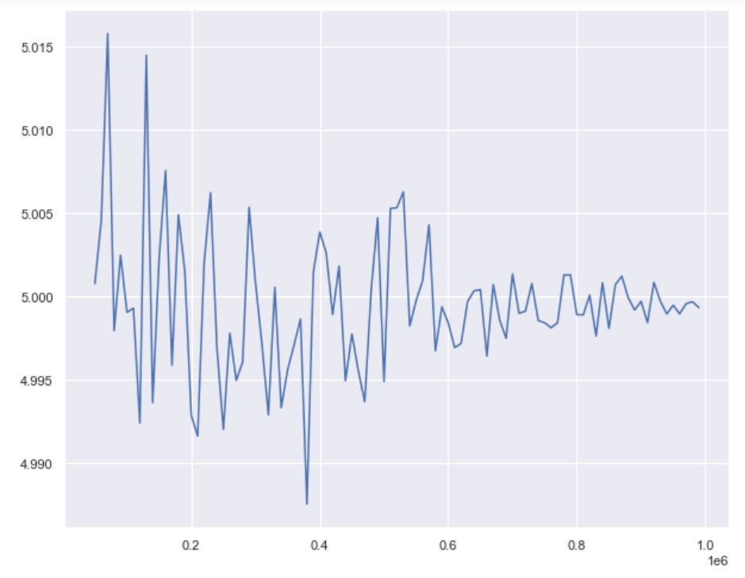

---
title: "Sampling and the Central Limit Theorem"
author: "Steve Elston"
date: "01/30/2021"
output:
  slidy_presentation: default
  pdf_document: default
  beamer_presentation: default
---

```{r setup, include=FALSE}
knitr::opts_chunk$set(echo = TRUE)
library(reticulate)
use_python("/usr/bin/python3")
matplotlib <- import("matplotlib")
matplotlib$use("Agg", force = TRUE)
#knitr::knit_engines$set(python = reticulate::eng_python)
```

----------------------------------------------------------------

## Review of Probability Distributions

- Common discrete and continuous distributions    

- **Probability mass function (PMF)** of discrete distributions are summed to find probability

- **Probability density function (PDF)** of continuous distributions is integrated to find probability

- **Inverse PDF/PMF** to find quantile of a given probability     

- **Simulation** uses realizations (draws) from independent and conditional distributions

---------------------------------------------------------

## Probability Distributions     

**Probability distributions** are models for uncertainty of **random variables**     

- A random variable is any **mapping**, $X$, from from some outcome of a random event, $\omega$, to a real number, $\mathbb{R}$:

$$X(\omega) \rightarrow \mathbb{R}$$

- **Example:** The mapping can be a count   

- **Example:** A function which transforms $\omega$ to a real number, $\mathbb{R}$   

- This concept appears abstract at first glance, but is fundamental to the theory of probability    
- We will see many examples in this course


----------------------------------------------------------------

## Common discrete distributions

**Discrete distributions** are characterized by their **probability mass functions (PMF)**

- **Discrete uniform:** for equally likely outcomes, such as the result of rolling a dice   

- **Bernoulli:** for a single binary outcome, such as a single coin flip    

- **Binomial:** the **number of "successes"** in $n$ independent Bernoulli trials with fixed probability $p$ of success, where "success" is defined by you, such as the number of heads in $n = 20$ coin flips    

- **Poisson:** used for modeling counts, such as the number of customers visiting a store on any day   

- **Geometric:** the number of Bernoulli trials (with $p$ fixed) before we see a successful outcome, such as the number of coin flips before we see a tails    

-------------------------------------------

## Common continuous distributions

**Continuous distributions** are defined by a **probability density function (PDF)**    

- **Uniform:** when ranges of data with equal length are equally likely, such as how gas molecules spread in a room      

- **Normal:** data that is symmetric and bell-shaped, such as people's height, or measurement error if instrument is not **biased**      

- **Exponential:** heavily right-skewed data, such as lifetime of a light bulb     

- **Log normal:** skewed data, such as "dwell time" on an online article     

- **Power law:** for data that appear to follow the **"80-20 rule"**      

- **Gamma and chi-square** is used for a sum of the squares of $k$ independent standard normal random variables, and is used by many **statistical tests**    


----------------------------------------------------------------

## today's agenda

- sample vs population
- sources of uncertainty
- sampling methods
- the law of large numbers
- the Central Limit Theorem


-----------------------------------------------------------------

## Introduciton to Sampling     

Sampling is a fundamental process in the collection and analysis of data    

- Sampling is important because we almost never have data on a whole population   

- Sampling must be randomized to preclude biases    

- Key points to keep in mind:   
  - Understanding sampling is essential to ensure data is representative of the entire population   
  - Use inferences on the sample to say something about the population   
  - The sample must be randomly drawn from the population  

- Sampling from distribution is the building block of simulation     

- We wil take up the topic of resampling later  

----------------------------------------------------------------

## sample vs population

- a **population** is a group of things / people we are targeting
- there is one population and it is usually very large, even infinite
  - all our current and future customers' age
  - all normally distributed numbers with mean $\mu$ and standard deviation $\sigma$
- we call $\mu$ and $\sigma$ **population parameters** and they are **fixed** (unless you're a Bayesian, but we return to this later)
- a **sample** is a smaller subset of the population (usually much smaller)
  - the age of the customers I have in the database *right now*
  - $n$ numbers drawn from $N(\mu, \sigma)$ (or any other distribution)
- we can compute **statistics** for our sample, such as the sample mean $\bar x$ and the sample standard deviation $s$, but statistics **vary** because samples vary

--------------------------------------

## Sampling Examples


| Use Case | Sample | Population |
|---|---|---|
| A/B Testing | The users we show either web sites A or B | All possible users, past present and future|   
|World Cup Soccer | 32 teams which qualify in one season | All national teams in past, present and future years|   
|Average height of data science students | Students in a data science class | All students taking data science classes world wide|   
|Tolerances of a manufactured part | Samples taken from production lines | All parts manufactured in the past, present and future |   
|Numbers of a species in a habitat |Population counts from sampled habitats |All possible habitats in the past, present and future |   

- In several cases it is not only impractical, but impossible to collect data from the entire population  

----------------------------------------------------

## Importance of Random Sampling   

All statistical methods rely on the use of **randomized unbiased samples**    

- Failure to randomized samples violates many key assumptions of statistical models     

- An understanding of proper use of sampling methods is essential to statistical inference      

- Most commonly used machine learning algorithms assume that training data are **unbiased** and **independent identically distributed (iid)**   
  - These conditions only met if training data sample is randomized   
  - Otherwise, the training data will be biased and not represent the underlying process distribution
  
----------------------------------------------------------------


## Introduction      

Sampling is a fundamental process in the collection and analysis of data    

- Sampling is important because we almost never have data on a whole population   

- Sampling must be randomized to preclude biases     

- As sample size increases, the standard error of a statistic computed from the sample decreases by the law of large numbers   

- Key points to keep in mind:   
  - Understanding sampling is essential to ensure data is representative of the entire population   
  - Use inferences on the sample to say something about the population   
  - The sample must be randomly drawn from the population  

- Sampling from distribution is the building block of simulation     

- We will take up the topic of resampling later    


## Sampling Example


| Use Case | Sample | Population |
|---|---|---|
| A/B Testing | The users we show either web sites A or B | All possible users, past present and future|   
|World Cup Soccer | 32 teams which qualify in one season | All national teams in past, present and future years|   
|Average height of data science students | Students in a data science class | All students taking data science classes world wide|   
|Tolerances of a manufactured part | Samples taken from production lines | All parts manufactured in the past, present and future |   
|Numbers of a species in a habitat |Population counts from sampled habitats |All possible habitats in the past, present and future |   

- In several cases it is not only impractical, but impossible to collect data from the entire population  

- We nearly always work with samples, rather than the entire population.    


## Importance of Random Sampling   

All statistical methods rely on the use of **randomized unbiased samples**    

- Failure to randomized samples violates many key assumptions of statistical models     

- An understanding of proper use of sampling methods is essential to statistical inference      

- Most commonly used machine learning algorithms assume that training data are **unbiased** and **independent and identically distributed (iid)**   
  - These conditions are only met if training data sample is randomized   
  - Otherwise, the training data will be biased and not represent the underlying process distribution
  


## Sampling Distributions   

Sampling of a population is done from an unknown **population distribution**, $\mathcal{F}$      

- Any statistic we compute for the generating process is based on a sample, $\hat{\mathcal{F}}$     
- The statistic is an approximation, $s(\hat{\mathcal{F}})$ of a **population parameter**   
   - For example, the mean of the population is $\mu$   
   - But, sample estiamte is $\bar{x}$   

- If we continue to take random samples from the population and compute estimates of a statistic, we generate a  **sampling distribution**   
   - Hypothetical concept of the sampling distribution is a foundation of **frequentist statistics**
   - Example, if we continue generating samples and computing the sample means, $\bar{x}_i$ for the ith sample   

- **Frequentist statistics** built on the idea of randomly resampling the population distribution and recomputing a statistic         
   - In the frequentist world, statistical inferences are performed on the sampling distribution    
   - Sampling process must not bias the estimates of the statistic

 
 
## Sampling Distributions   

Sampling of a population is done from an unknown **population distribution**, $\mathcal{F}$      

- Any statistic we compute for the generating process is an approximation for the population, $s(\hat{\mathcal{F}})$  

```{r Sampling, out.width = '60%', fig.cap='Sampling distribution of unknown population parameter', fig.align='center', echo=FALSE}
knitr::include_graphics(rep("../images/SamplingDistribuion.png"))
```
 

## Sampling and the Law of Large Numbers

The **law of large numbers** is a theorem that states that **statistics of independent random samples converge to the population values as more samples are used**      

- Example, for a population distribution, $\mathcal{N}(\mu,\sigma)$, the sample mean is:

$$Let\ \bar{X} = \frac{1}{n}\sum_{i=1}^{n} X_i$$

Then by the law of Large Numbers:

$$ \bar{X} \rightarrow E(X) = \mu\\
as\\
n \rightarrow \infty$$

- This result is reassuring, the larger the sample the more the statistic converges to the population parameter 


## Sampling and the Law of Large Numbers

The law of large numbers is foundational to statistics    

- We rely on the law of large numbers whenever we work with samples   

- Assume that **larger samples are more representatives of the population we are sampling**     

- Is foundation of sampling theory, plus modern computational methods;  simulation, bootstrap resampling, and Monte Carlo methods   

- If the real world did not follow this theorem, then much of statistics (to say nothing of science and technology as a whole) would have to be rethought


-------------------------------------   

## Sampling and the Law of Large Numbers   

The law of large numbers has a long history     

- Jacob Bernoulli posthumously published the first proof for the Binomial distribution in 1713   

- Law of large numbers is sometimes referred to as **Bernoulli's theorem**     
  
- A more general proof was published by Poisson in 1837.  

-------------------------------------   

## Sampling and the Law of Large Numbers

A simple example     

- The mean of fair coin flips (0,1) = (T,H) converges to the expected value with more flips      

- The mean converges to the expected value of 0.5 for $n = 5, 50, 500, 5000$  


```{python, echo = FALSE}
import numpy as np
import numpy.random as nr
import pandas as pd
import statsmodels.api as sm
import matplotlib.pyplot as plt
import seaborn as sns

import math
```

```{python, echo = FALSE}
nr.seed(3457)
n = 1
p = 0.5
size = 1000000
# Create a large binomial distributed population. 
pop = pd.DataFrame({'var':nr.binomial(n, p, size)}) 
# Sample the population for different sizes and compute the mean
sample_size = [5, 50, 500, 5000]
out = [pop.sample(n = x).mean(axis = 0) for x in sample_size] 
for n,x in zip(sample_size,out): print("%.0f  %.2f" %(n, x))
```

## Sampling and the Law of Large Numbers

A simple example; mean of fair coin flips (0,1) = (T,H) converges to the expected value with more flips      


```{r LLN_Bernoulli, out.width = '60%', fig.cap='Convergance of mean estimates for fair coin', fig.align='center', echo=FALSE}
knitr::include_graphics(rep("../images/LLN_Bernoulli.png"))
```


## the Central Limit Theorem (CLT)

- Law of large number is almost too obvious, but the CLT is more tricky!     

- Law of large number applied to any statistic, but the CLT applies only to the **mean**     

- Let $X$ be a random variable representing the population     
   - $X$ is allowed to have **any distribution** (not limited to normal), and let $\mu$ be your **true population mean** and $\sigma$ the **true population standard deviation**
   - Given sample size $n$ thee sampling distribution of $\bar X$is 

$$\bar X \sim N(\mu, \frac{\sigma}{\sqrt n})$$

## importance of CLT

CLT is a sort of guarantee    

- Sampling distribution of mean estimates do not depend on the population the sample was drawn from   
- **Standard deviation** $s$ of the sampling distribution of $\bar{x}$ converges as $1/\sqrt n$


- Only depends on the population's mean and variance, and on the sample size     

- CLT is the basis for hypothesis testing    


## Example of CLT

Start with a mixture of Normal distributions   

```{python, echo=FALSE}
x = np.concatenate([
        nr.normal(loc=0, scale=1, size=1000),
        nr.normal(loc=3, scale=.5, size=1000)])
        

fig, ax = plt.subplots(figsize=(3.5, 2.5), )          
sns.kdeplot(x, ax=ax)
```


## Example CLT    

Sample distribution of the mean of mixture of Normals is Normally distributed!    

```{python, echo=FALSE}
x_means = np.array([
        nr.choice(x, size=50, replace=True).mean()
        for i in range(500)])

breaks = np.linspace(x_means.min(), x_means.max(), num=40)
fig, ax = plt.subplots(1,2, figsize=(6, 2.5) ) 
_ = ax[0].hist(x_means, bins=breaks)
_ = sm.qqplot(x_means, line='s', ax=ax[1])
```

## Standard Error and Convergence for a Normal Distribution

As we sampled from a Normal distribution, the mean and standard deviation of the sample converged to the population mean    

- What can we say about the expected error of the mean estimate as the number of samples increases?   
   - This measure is known as the **standard error** of the sample mean    
   - As corollary of the law of large numbers the standard error is defined:

$$se = \pm \frac{sd}{\sqrt{(n)}}$$

- Standard error decreases as the square root of $n$   
   - Example, if you wish to halve the error, you will need to sample four times as many values.   

- For the mean estimate, $\bar{x}$, define the uncertainty in terms of **confidence intervals**    
   - For 95% confidence interval:

$$CI_{95} =\bar{x} \pm 1.96\ se$$ 


## Convergence and Standard Errors for a Normal Distribution

Mean estimates for realizations of standard Normal distribution with standard errors


```{r MeanConvergenceSEs, out.width = '40%', fig.cap='Convergance of mean estimates with standard errors', fig.align='center', echo=FALSE}
knitr::include_graphics(rep("../images/MeanConvergenceSEs.png"))
```


## Sampling Strategies

There are a great number of possible sampling methods. 

- Some of the most commonly used methods

- **Bernoulli sampling**, a foundation of random sampling   

- **Stratified sampling**, when groups with different characteristics must be sampled   

- **Cluster sampling**, to reduce cost of sampling     

- **Systematic sampling and convenience sampling**, a slippery slope


---------------------------------------------------------

## Bernoulli Sampling

**Bernoulli sampling** is a widely used foundational random sampling strategy    

- Bernoulli sampling has the following properties:    

- A **single random sample** of the population is created    

- A particular value in the population is selected based on the outcome of a Bernoulli trial with fixed probability of success, $p$     

- Example, a company sells a product by weight     
  - To ensure the quality of a packaging process so few packages are underweight   
  - Impractical to empty and weight the contents of every package   
  - Bernoulli randomly sampled packages from the production line and weigh contents   
  - Statistical inferences are made from sample 


--------------------------------------------------

## Bernoulli Sampling

An example with synthetic data. 
- Generate 2000 random samples from the standard Normal distribution    
- The realizations are randomly divided into 4 groups with $p = [0.1,0.3,0.4,0.2]$     
- The probability of a sample being in a group is not uniform, and sums to 1.0.  

- Head of the data frame is displayed:

```{python, echo=FALSE}
nr.seed(345)
population_size = 10000
data = pd.DataFrame({"var":nr.normal(size = population_size), 
                     "group":nr.choice(range(4), size= population_size, p = [0.1,0.3,0.4,0.2])})
data.head(10)
```

--------------------------------------------------

## Bernoulli Sampling

The population of 2000 values was sampled from the standard Normal distribution    

The mean of each group should be close to 0.0:    
1. The sample is divided between 4 groups     
2. Summary statistics are computed for each group      

```{python, echo=FALSE}
def count_mean(dat):
    import numpy as np
    import pandas as pd
    groups = dat.groupby('group') # Create the groups
    n_samples = groups.size()
    se = np.sqrt(np.divide(groups.aggregate(np.var).loc[:, 'var'], n_samples))
    means = groups.aggregate(np.mean).loc[:, 'var']
    ## Create a data frame with the counts and the means of the groups
    return pd.DataFrame({'Count': n_samples, 
                        'Mean': means,
                        'SE': se,
                        'Upper_CI': np.add(means, 1.96 * se),
                        'Lower_CI': np.add(means, -1.96 * se)})
count_mean(data)
```


--------------------------------------------------

## Sampling Grouped Data

Group data is quite common in application

A few examples include:     

1. Pooling opinion by county and income group, where income groups and counties have significant differences in population        

2. Testing a drug which may have different effectiveness by sex and ethnic group    

3. Spectral characteristics of stars by type  


-----------------------------------------------

## Stratified Sampling     

What is a sampling strategy for grouped or stratified data?    

- **Stratified sampling** strategies are used when data are organized in **strata**    

- **Simple Idea:** independently sample an equal numbers of cases from each strata   

- The simplest version of stratified sampling creates an **equal-size Bernoulli sample** from each strata

- In many cases, nested samples are required  
  - For example, a top level sample can be grouped by zip code, a geographic strata     
  - Within each zip code, people are then sampled by income bracket strata    
  - Equal sized Bernoulli samples are collected at the lowest level     
  
  
-----------------------------------------------------

## Example    

Bernoulli sample 100 from each group and compute summary statistics

```{python, echo=FALSE}
p = 0.01
def stratify(dat, p):
    groups = dat.groupby('group') # Create the groups
    nums = min(groups.size()) # Find the size of the smallest group
    num = int(p * dat.shape[0]) # Compute the desired number of samples per group
    if num <= nums: 
        ## If sufficient group size, sample each group.
        ## We drop the unneeded index level and return, 
        ## which leaves a data frame with just the original row index. 
        return groups.apply(lambda x: x.sample(n=num)).droplevel('group')
    else: # Oops. p is to large and our groups cannot accommodate the choice of p.
        pmax = nums / dat.shape[0]
        print('The maximum value of p = ' + str(pmax))
stratified = stratify(data, p)
count_mean(stratified)
```


--------------------------------------

## Cluster Sampling

When sampling is expensive, a strategy is required to reduce the cost  

- Examples of expensive to collect data:   
  - Surveys of customers at a chain of stores   
  - Door to door survey of homeowners   
  - Sampling wildlife populations in a dispersed habitat     

Population can be divided into randomly selected clusters:    
  - Define the clusters for the population    
  - Randomly select the required number of clusters   
  - Sample from selected clusters    
  - Optionally, stratify the sample within each cluster   


--------------------------------------

## Cluster Sampling

As an example, select a few store locations and Bernoulli sample customers at these locations.


```{python, echo=FALSE}
## First compute the clusters
num_clusters = 10
num_vals = 1000
## Create a data frame with randomly sampled cluster numbers
clusters = pd.DataFrame({'group': range(num_clusters)}).sample(n = num_vals, replace = True)
## Add a column to the data frame with Normally distributed values
clusters.loc[:, 'var'] = nr.normal(size = num_vals)
```

```{python, echo=FALSE}
count_mean(clusters)
```


--------------------------------------

## Cluster Sampling

Randomly select 3 clusters

```{python, echo=FALSE}
## Randomly sample the group numbers, making sure we sample from 
## unique values of the group numbers. 
clusters_samples = nr.choice(clusters.loc[:, 'group'].unique(), 
                             size = 3, replace = False)
## Now sample all rows with the selected cluster numbers
clus_samples = clusters.loc[clusters.loc[:, 'group'].isin(clusters_samples), :]
print('cluster sampled are: ')
for x in clusters_samples:
    print(x)
```

Display summary statistics 

```{python, echo=FALSE}
count_mean(clus_samples)
```

------------------------------

## Systematic Sampling

**Convenience and systematic sampling** are a slippery slope toward biased inferences      

- Systematic methods lack randomization    

- Convenience sampling selects the cases that are easiest to obtain     
  - Commonly cited example known as **database sampling**      
  - Example, the first N rows resulting from a database query     
  - Example, every k-th case of the population   
  
  
-------------------------------------------------

## A Few More Thoughts on Sampling

There are many practical aspects of sampling.

- Random sampling is essential to the underlying assumptions of statistical inference    

- Whenever you are planning to sample data, make sure you have a clear sampling plan     

- Know the number of clusters, strata, samples in advance    

- Don’t just stop sampling when your desired result is achieved: e.g. error measure!     


## sources of uncertainty

- if we had access to the **whole population** we could measure anything we wanted, and our uncertainty about it is called [epistemic uncertainty]
- but that's usually not possible, or at least very expensive (such as the census), so in practice, we only have a **sample**, and we hope that the sample is **representative** of the larger population (otherwise we have a **biased sample**)
- so what we wanted to measure on the population (the **parameter**), we measure it on the sample (the **statistic**): the statistic is an **estimate** of the parameter
- because samples vary, we now have additional uncertainty, called **statistical uncertainty**, to account for: this is what **statistical inference** is all about

[epistemic uncertainty]: https://en.wikipedia.org/wiki/Uncertainty_quantification

----------------------------------------------------------------


----------------------------------------------------------------

## sampling methods

Suppose the data has $N$ rows, and can be grouped into $K$ subsets      

- **simple random sample:** give me $n$ rows at random ($n < N$)     

- **Bernoulli sample:** for each row of the data, toss a coin with probability $p$ of heads to determine if it should be in the sample or not      

- **stratified sample:** for each of the $K$ subsets, give me $m$ rows at random    

- **cluster sample:** first choose $k < K$ subsets at random, and choose $m$ samples for each of those subsets     

- **systematic sample:** give me every $i$th row of the data     


----------------------------------------------------------------

## Discussion

You have been charged with finding the share of an American household's budget that goes towards child care

- let's say you conduct a **census**    
  - what is your population and your **population parameter**?    
  - what are some examples of **epistemic uncertainty**?    
  
- let's say you conduct a **survey** instead    
  - what is your statistic?    
  - what kind of **sampling** would you perform?    
  - what are some **sampling bias** problems you could run into?   
  - what are some examples of **statistical uncertainty**?    
  

----------------------------------------------------------------

## the law of large numbers

A fundamental property of statistics (not just statistics the science, but more specifically statistics as measurements derived from **samples**, such as mean, median, IQR, variance, min, max, and so on)     

- recall that **statistics** are *estimates* for **parameters**:    
  - the **sample mean** is an estimate for the true **population mean**    
  - the **sample variance** is an estimate for the true **population variance**    
  - and so on, and so forth    
  
- the **law of large numbers** states that the *larger* the **sample size**, the *better* the **estimate**: as we increase the sample size the sample becomes more representative of the population (and eventually the sample *is* the population)    

----------------------------------------------------------------

## Discussion

Here is an example of the law of large numbers visualized

```
n, p, size = 100, 0.5, 10**6
pop = pd.DataFrame({'x': nr.binomial(n, p, size)})
n_range = np.arange(1, 10**6, 10000) 
out = [pop.sample(n = x)['x'].std(axis = 0) for x in n_range]

sns.lineplot(x = n_range[5:], y = out[5:])
```

- what is the population?     

- what is the population parameter we want to estimate?      

- what do the axes on the plot represent?      



----------------------------------------------------------------

## [break time]

----------------------------------------------------------------

## the Central Limit Theorem (CLT)

- Law of large number is almost too obvious, but the CLT is more tricky!     

- Law of large number applied to any statistic, but the CLT applies only to the **mean**     

- Let $X$ be a random variable representing the population     

- $X$ is allowed to have **any distribution** (not limited to normal), and let $\mu$ be your **true population mean** and $\sigma$ the **true population standard deviation**    

- Let $\bar X$ be the **sample mean** for a **hypothetical** sample of size $n$ from the population, recall that different samples give different $\bar X$ values, so $\bar X$ is also a random variable     

- The distribution of $\bar X$ is called the **sampling distribution**, and according to CLT 

$$\bar X \sim N(\mu, \frac{\sigma}{\sqrt n})$$

----------------------------------------------------------------


----------------------------------------------------------------

## importance of CLT

CLT is a sort of guarantee    

- Distribution of the sample mean doesn't depend on the population the sample was drawn from   

- Only depends on the population's mean and variance, and on the sample size     

- CLT is the basis for hypothesis testing (next lesson)     


----------------------------------------------------------------

## [notebook time]
### we return to the lecture later

----------------------------------------------------------------

## the end
