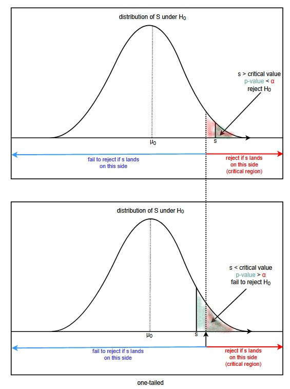
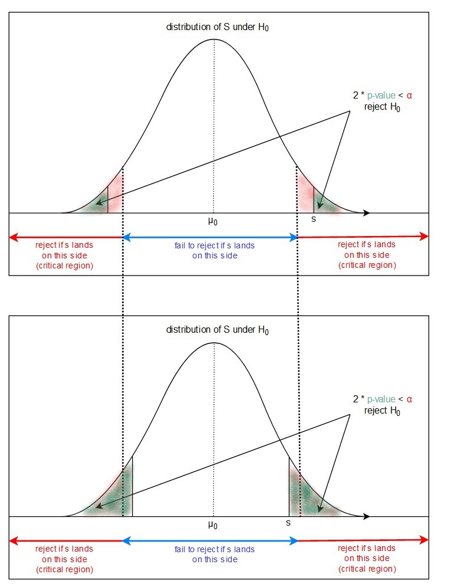

---
title: "Introduction to Hypothesis Testing"
author: "Steve Elston"
date: "01/30/2021"
output:
  slidy_presentation: default
  pdf_document: default
  beamer_presentation: default
  html_document:
    df_print: paged
  ioslides_presentation: default
---

```{r setup, include=FALSE}
knitr::opts_chunk$set(echo = TRUE)
library(reticulate)
use_python("/usr/bin/python3")
matplotlib <- import("matplotlib")
matplotlib$use("Agg", force = TRUE)
#knitr::knit_engines$set(python = reticulate::eng_python)
```

----------------------------------------------------------------

## Overview of Hypothesis Testing 

*"Critical tests of this kind may be called tests of significance, and when such tests are available we may discover whether a second sample is or is not significantly different from the first."*

Ronald A. Fisher - 1925

- Basic hypothesis tests
- Types of hypothesis tests
- Steps in a test of hypothesis
- Multiple hypotheses and P-value fishing


## Introduction to Statistical Inference       

All statistical inference has uncertainty    

- Characterization of uncertainty is a goal of statistical inference  
  - Any model using real-world data has inherent uncertainty  
  
- Statistical inference seeks to avoid being [**fooled by randomness**](https://www.penguinrandomhouse.com/books/176225/fooled-by-randomness-by-nassim-nicholas-taleb/); A catchy title of a book  

- A very few examples where proper statistical inference is important

| Hypothesis  | Fooled by Randomness |
|:----------------------- | :----------------- |
| How certain are you that eating fast food improves your health? | Some of my friends are doing great on this diet |   
| How much confidence should we have that a marketing campaign increased sales? | Sales are up in the last month since the campaign started |  
| How effective is a certain stock trading strategy for actually improving returns? | Traders using this strategy have made money recently | 
| How good are the model parameter estimates? | The model has made accurate predictions so far | 
   


## Applications of Statistical Inference

Confusingly, the term statistical inference is applied in many contexts

Some applications of statistical inference include:

**Inference on differences in distributions:** Are samples drawn from the same distribution or not?
- A **null hypothesis** is the hypothesis that the distributions are the same      

**Inference for model parameters and model selection:** Statistical models, including machine learning models, have unknown parameters for which the values must be estimated      
- Compute uncertainty in model parameter estimates    
- Compare model performance     

**Inference for prediction:** In recent decades the distinction between prediction and classical inference has blurred to the point of being irrelevant     
- A common machine learning example, classification, uses decision rules determine the most likely class for each case of input values      
- inference also used to determine the confidence in predictions      

  
----------------------------------------------------------------


## Sampling Distributions   

Sampling of a population is done from an unknown **population distribution**, $\mathcal{F}$      

- Any statistic we compute for the generating process is based on a sample, $\hat{\mathcal{F}}$     
- The statistic is an approximation, $s(\hat{\mathcal{F}})$ of a **population parameter**   
   - For example, the mean of the population is $\mu$   
   - But, sample estiamte is $\bar{x}$   

- If we continue to take random samples from the population and compute estimates of a statistic, we generate a  **sampling distribution**   
   - Hypothetical concept of the sampling distribution is a foundation of **frequentist statistics**
   - Example, if we continue generating samples and computing the sample means, $\bar{x}_i$ for the ith sample   

- **Frequentist statistics** built on the idea of randomly resampling the population distribution and recomputing a statistic         
   - In the frequentist world, statistical inferences are performed on the sampling distribution    
   - Sampling process must not bias the estimates of the statistic

 
 
## Sampling Distributions   

Sampling of a population is done from an unknown **population distribution**, $\mathcal{F}$      

- Any statistic we compute for the generating process is an approximation for the population, $s(\hat{\mathcal{F}})$  

```{r Sampling, out.width = '60%', fig.cap='Sampling distribution of unknown population parameter', fig.align='center', echo=FALSE}
knitr::include_graphics(rep("../images/SamplingDistribuion.png"))
```


## Confidence Intervals; the Key to Inference     

In frequentist statistics uncertainty of an inference is expressed in terms of a **confidence interval**     

- A confidence interval is defined as the expected range of a statistical **point estimate**   
  - A point estimate is the best statistical estimate of some value   
  - For example, the most likely value of a model parameter given the data   

- Two types of of confidence intervals:   
  - **Two-sided confidence intervals:** express confidence that a value is within some range around the point estimate 
  - **One-sided confidence intervals:** express confidence that the point estimate is greater or less than some range of values

## Confidence Intervals; the Key to Inference   

Can understand confidence intervals by looking at the $\alpha$ and $1 - \alpha$ quantiles of a distribution    

- Confidence interval corresponds to the span of the distribution between quantiles    

- Express a 2-sided confidence interval for a random variable, $\mathbf{x}$, in terms of the probability as:  

$$1-2 \alpha = P \Big( Lower\ CI \le \mathbf{x} \le Upper\ CI \Big)$$

- Alternatively for one-sided CIs:    

$$\alpha  = P(x \ge Upper\ CI)\ \\ and \\\ 1 - \alpha = P(x \le Lower\ CI)$$


## Example; confidence intervals of the Normal distribution

Illustrate the concept of confidence intervals with an example

- The **cumulative distribution function (CDF)** of a standard Normal distribution, $N(0,1)$  

- Double ended arrows with annotation are plotted to illustrate the 95% confidence interval on the CDF  
  - Horizontal double arrow shows the range of the confidence interval    
  - Vertical double arrow shows the part of the distribution within the confidence intervals
    

```{python, echo=FALSE}
## Import
import matplotlib.pyplot as plt
import numpy as np
from scipy.stats import norm, chi2, t
from scipy.optimize import brentq

def plot_confidence(distribution, alpha, xmin, xmax, dist_type, step=0.05):
    ## Set the font size and compute the CI for dispaly
    plt.rc('font', size=8)
    percent = str(int((1.0-2*alpha)*100))
    
    ## first find the cummulates 
    x = np.arange(start=xmin, stop=xmax, step=0.05)
    cumulates = distribution(x)
    
    ## plot the figure
    fig, ax = plt.subplots(figsize=(5, 4), )  
    ax.plot(x, cumulates, linewidth=6)
    ax.hlines(y=0.0, xmin=xmax, xmax=xmin, linewidth=2, color='black')
    ax.set_title('Cummulative distribution of ' + dist_type + ' with ' + percent + ' confidence intevals')
    ax.set_ylabel('Probability')
    ax.set_xlabel('Value')
    
    ## Plot horizontal lines at the quantiles 
    ax.hlines(y=alpha, xmin=xmax, xmax=xmin, linewidth=6, color='r', linestyle='dotted')
    ax.hlines(y=1.0-alpha, xmin=xmax, xmax=xmin, linewidth=6, color='r', linestyle='dotted')
    
    ## Fine the probabilities at the quantiles and plot vertical lines   
    ## To do so, find the root of a function of the distribution
    lower_ci = brentq(lambda x: distribution(x) - alpha, xmin, xmax)
    ax.vlines(x=lower_ci, ymin=-0.2, ymax=1.0, linewidth=4, color='r', linestyle='dashed')
    upper_ci = brentq(lambda x: distribution(x) - 1 + alpha, xmin, xmax)
    ax.vlines(x=upper_ci, ymin=-0.2, ymax=1.0, linewidth=4, color='r', linestyle='dashed')
    
    ## Display the numeric results
    print("Confidence Interval, lower: {0:5.2f}, upper: {1:5.2f}".format(lower_ci, upper_ci))
    
    ## Place double headed arrows for the range and confidence interval
    ax.arrow(xmin,alpha,0.0,1-2*alpha-0.05, head_width=0.2, head_length=0.05, linewidth=3)
    ax.arrow(xmin,1.0-alpha,0.0,-1+2*alpha+0.05, head_width=0.2, head_length=0.05, linewidth=3)
    ax.text(xmin+0.1, 0.5, percent + '% of\nDistribution')
    ax.arrow(lower_ci,-0.1,upper_ci-lower_ci-0.1, 0, head_width=0.05, head_length=0.1, linewidth=3)
    ax.arrow(upper_ci,-0.1,-upper_ci+lower_ci+0.1, 0, head_width=0.05, head_length=0.1, linewidth=3)
    ax.text((upper_ci + lower_ci)/2-1.0, -0.15, percent + '% Confidence Interval')
    plt.show()

distribution = norm.cdf
plot_confidence(distribution, 0.025, -3.0, 3.0, 'Normal')
```


## Example, Inference for the mean

$$CI(mean) = CI(\bar{\mathbf{X}}) = MLE(\theta | \mathbf{X})\ \pm\ \frac{s}{\sqrt{n}} Z_\alpha$$

Where,       
- $Z_\alpha$ is the standard Normal distribution evaluated at confidence level, $\alpha$   
- standard error is given by $s/ \sqrt{n}$    
- $s$ is the standard deviation estimate   
- $n$ is the number of samples.   


## Interpretation of Confidence Intervals      

How can we interpret the confidence interval?    

- Confidence intervals are with respect to the the sampling distribution of a statistic $s(\hat{\mathcal{F}})$  

- Two-sided interval, $1 - 2 \alpha$, represent uncertainty in the sample statistic values computed from repeated samples of the population, $\hat{\mathcal{F}}_i$    

- Confidence intervals do not indicate the probability  $s(\hat{\mathcal{F}})$ is in a range


```{r Sampling_2, out.width = '50%', fig.cap='Sampling distribution of unknown population parameter', fig.align='center', echo=FALSE}
knitr::include_graphics(rep("../images/SamplingDistribuion.png"))
```


----------------------------------------------------------------

## Test of Hypothesis

- a **test of hypothesis** is made of two statements, each being an educated guess about the true value of the **parameter(s)** of one or several populations
- the **null hypothesis** $H_0$ usually says something "uninteresting" and they suggest a points toward some status quo, such as
    - the effect of this drug is not significantly than the control in reducing headaches     
    - these two groups came from the same underlying distribution     
- the **alternative hypotheses** $H_1$ is a competing statement that suggest something to the contrary and suggests some interesting **effect**, such as    
    - a drug is significantly difference from a **control**     
    - Yield of wheat is significantly different between two seed types    
    
- There can be many alternative hypotheses    
  - There is a significant difference in means
  - Difference in means is greater    
  - Difference in means is less
  - Can be an infinite number; e.g. alternative distributions


----------------------------------------------------------------

## Examples of null and alternative hypotheses

| test | parameter | null hypothesis $H_0$ | alternative hypothesis $H_1$ (one-tailed) | alternative hypothesis $H_1$ (two-tailed) |
| --- | --- | --- | --- | --- |
| mean | $\mu$ | $\mu = c$ | $\mu < c$ (or $>$) | $\mu \ne c$ |
| variances | $\sigma_1, \sigma_2$ | $\sigma_1 = \sigma_2$ | $\sigma_1 < \sigma_2$ (or $>$) | $\sigma_1 \ne \sigma_2$
| distribution | $\mu, \sigma$ | $X \sim N(\mu, \sigma)$ | N/A | $X \not \sim N(\mu, \sigma)$ |
| correlation | $\rho$ | $\rho(X,Y) = 0$ | $\rho(X,Y) > 0$ | $\rho(X,Y) \ne 0$ |

------------------------------------------------------------

## Hypothesis testing steps

The steps required to perform a formal two-sample hypothesis test

- State population assumptions of null hypothesis: $H_0$    

- State alternative hypothesis: $H_a$    
  - Typically stated in terms of a **treatment group** vs. **control group**    
  - Treatment is the factor that differentiates the population     
  
- Decide on a significance level (probability cutoff or **Type I error threshold**): e.g. 0.1, 0.05, and 0.01    

- Data is collected for the different treatments 
  - Treatment used for comparison is the **control**

- Compute the **test statistic** and evaluate based on the cutoff value     

---------------------------------------------------------------

## Hypothesis testing steps

- Think of $H_0$ and $H_1$ as two assumptions *about the population* opposed to each other and competing for attention
- Under the assumption of $H_0$, we expect the statistic(s) we collect to follow a certain distribution (or some other condition)
3. Collect a sample of data (our **evidence**), compute the statistic(s) and probability to get the statistic(s) if $H_0$'s holds, or the **p-value**
4. Compare the p-value to the pre-determined threshold $\alpha$, or **type-I error** threshold, usually $\alpha = 0.01$ or $\alpha = 0.05$
5. If p-value $< \alpha$ we **reject $H_0$**, otherwise we **fail to reject $H_0$**   
  - We avoid saying that we "accept" $H_0$
  - p-value $< \alpha$ does **not** mean we accept the alternative
  - May be able tox conclude $H_a$ in certain cases  


------------------------------------------------------------

## Hypothesis testing steps

Test statistic used a a **decision rule**

- Only two possible outcomes  
  - **Reject the null-hypothesis:** This is not the same as accepting the alternative hypothesis    
  - **Fail to reject the null hypothesis:** This is not the same as accepting the null hypothesis  
  
- Failing to rejecting the null hypothesis can occur for several reasons       
  - The alternative hypothesis was false to begin with     
  - There is not enough evidence for the **effect size**    
  
- Roughly speaking, the effect size is the difference of the test statistic in populations under the different treatments   


----------------------------------------------------------------

## the p-value

- P-value is the probability, under $H_0$, that we get a statistic **as extreme or more extreme** than the one we got          

- **Extreme** depends on whether the test is **one-tailed** or **two-tailed**      

- Derive the p-value by computing the **statistic(s)** and evaluate the quantile of the null distribution, $H_0$     

- Low p-value means our evidence against $H_0$ is too strong to ignore 
  - How strong it needs to be is controlled by our choice of $\alpha$    
  - **Smaller $\alpha$** means we need **stronger evidence** to reject $H_0$; a more **conservative** test      
  
- Together the p-value and the significance threshold $\alpha$ determine whether we reject or fail to reject $H_0$      
  - The decision rule of the hypothesis test     

----------------------------------------------------------------

## a simple test of hypothesis

- say we have a random variable $X$ that follows an unknown distribution
- $H_0: \mu = 23, \sigma = 10$
- $H_1: \mu \ne 23, \sigma = 10$ and we choose $\alpha = 0.05$
- we collect a sample of size $17$ and compute the sample mean $\bar x = 20.2$
- by the CLT we know that $\bar X \sim N(\mu, \frac{\sigma}{\sqrt n}) = N(23, 10/\sqrt{17})$
- we refer to $N(23, 10/\sqrt{17})$ and look up the probability of getting $\bar x = 20.2$ or something more extreme (farther away from 23 than 20.2 is, in either direction because the test is two-tailed)
- we can look up the p-value in Python by running `2*scipy.stats.norm.cdf(20.2, loc = 23, scale = 10/np.sqrt(17)) -> 0.25` (we multiply by two because the test is two-tailed), so we fail to reject $H_0$

----------------------------------------------------------------

## one-tailed test of hypothesis

- $H_0: \mu = \mu_0$ vs $H_a: \mu > \mu_0$
- if the statistic falls in the **critical (red) region**, we reject $H_0$ because p-value $< \alpha$ (top graph)
- if the statistic falls in the **blue region**, we fail to reject $H_0$ because p-value $> \alpha$ (bottom graph)



----------------------------------------------------------------

## two-tailed test of hypothesis

- $H_0: \mu = \mu_0$ vs $H_a: \mu \ne \mu_0$
- if the statistic falls in the **critical (red) region**, we reject $H_0$ because $2\times$p-value $< \alpha$ (top graph)
- if the statistic falls in the **blue region**, we fail to reject $H_0$ because $2\times$p-value $> \alpha$ (bottom graph)




--------------------------------------------

## Student t-distribution

[**Student t-distribution**](https://en.wikipedia.org/wiki/Student%27s_t-distribution), or simply the t-distribution, is the distribution of the difference of means of two Normally distributed random variables  

- One and two tailed hypothesis test of difference of means for Normally distributed random variables based on t-distribution - the **t-test** family      

- t-distribution has one parameter, the **degrees of freedom**, denoted as $\nu$        

- The PDF of the t-distribution is a rather complex looking result:

$$
P(x\ |\ \nu) = \frac{\Gamma(\frac{\nu + 1}{2})}{\sqrt{\nu \pi} \Gamma(\frac{\nu}{2})} \bigg(1 + \frac{x^2}{\nu} \bigg)^{- \frac{\nu + 1}{2}}\\
where\\
\Gamma(x) = Gamma\ function
$$

-----------------------------------------       

## Student t-distribution

[**Student t-distribution**](https://en.wikipedia.org/wiki/Student%27s_t-distribution), or simply the t-distribution, is the distribution of the difference of means of two Normally distributed random variables  


- t-distribution has one parameter, the **degrees of freedom**, denoted as $\nu$   


```{python, echo=FALSE}
plt.figure(figsize=(8,6));
x = np.linspace(-4, 4, num=100)

# Plot the normal distribution PDF
plt.plot(x, norm.pdf(x), color='black', linewidth=4, label='N(0,1)');
for df, color in zip([1, 2, 5, 1000], ['red', 'blue', 'green', 'orange']):  
  plt.plot(x, t.pdf(x, df), label='t(%d)' % df, color=color);
_ = plt.legend();
```


----------------------------------------------------------------

## Power of Tests

The **power of a test** is often neglected, leading to poor test results   

- Power is formally defined as:

$$power = P(reject\ H_0| when\ H_a\ is\ true)$$

- In pain language, the **power is the probability of not rejecting $H_\alpha$$ when we should do so**      
  - Conversely, a test with **insufficient power will not detect a real effect**     
  - Clearly, we want the most powerful test possible    

- Computing test power can be a bit complex     
   - Analytical solutions can be difficult or impossible    
   - Often, a simulation is used to compute power. 

----------------------------------------------------------------

## Power of Tests

Consider the power for the two sample t-test for the difference of means which depends on:    

- The type of test    

- The number of samples      

- The anticipated difference in the population means, or **effect size**       

- The significance level of  the test       


----------------------------------------------------------------

## Power of Tests

When computing power, you can ask several questions        

- Typically, determine how big a sample is required to have high probability of rejecting the null hypothesis given the expected effect size     
    - Often, a power level of 0.8 is considered adequate   
    - But, power level of 0.8 leaves a 1 in 5 chance of not detecting the desired effect      
  
- Or, determine how big an effect is required for a fixed sample size to have hight probability of rejecting the null hypothesis    

- Finally, determine the how different cutoff values change the probability of detecting an effect.   

------------------------------------------------------------

## Hypothesis Tests on Counts

How can we perform an hypothesis test on count data?    

- Pearson $\chi2$ (Chi-squared) test is an unpaired test for counts in different categories.
  - The null distribution is that there is no difference from the expected number of counts   
  - Tests if counts of categories significantly different      
  - These categories must be mutually exclusive. For example, does the patient have cancer?    
  
- Examples of test on counts    
  * Do the six categories of a die, (1,2,3,4,5,6), occur the same frequency (fair die)?    
  * Do a group of tweets contain a specific word with unexpectedly high or low frequency?   

--------------------------------------------------------

## Pearson's Chi-Squared Test

The difference in counts is $\chi^2$ distributed, giving the test its name    

- The $\chi^2$ statistic depends on the **degrees of freedom** of the test    
  - Degrees of freedom (DOF) are equal to n-1, with $n =$ the number of different categories     


<center>Chi-square distribution for different degrees of freedom</center>

- Confidence intervals and p-values can be computed    

- The $\chi$-squared distribution becomes flatter and with greater dispersion as the degrees of freedom increase       
  - In practice, this means that you will need large samples to get a meaningful result if you have many categories     


--------------------------------------------------------

## Pearson's Chi-Squared Test

How do we build a $\chi2$ test?      

- $\chi^2$ test displayed as a Chi-squared table    

- Test uses the sum of the differences of outcomes from expectations      
  - Test if your sample has expected make up of counts from different categories
  - Example, if our population has equal numbers of men and women, then we can test if our sample is different from those expected probabilities.


--------------------------------------------------------

##  Building a Chi-squared table

A $\chi^2$ table typically has columns      
  - The actual occurrence of events   
  - The expected probability of these events; **distribution of the null hypothesis**  
  - The expected occurrence of events given the expected probabilities under the null hypothesis
  - The difference between the occurrence and the expected number of events under the null hypothesis     
  - The square of the difference    
  - The sum of squared differences normalized by the expected number of occurrences; the $\chi2$ statistic. 

```{python, echo=FALSE}
import pandas as pd
import numpy as np
import statsmodels.stats.power as ssp
import matplotlib.pyplot as plt
pd.set_option('display.max_columns', None)

ab_data = pd.DataFrame({'Action':['Leave Page', 'Continue Purchase', 'Add More to Purchase'],
                       'occurrence':[55,43,22],
                       'expected_per':[0.6,0.3,0.1]})
sum_occurrence = ab_data.loc[:, 'occurrence'].sum()
ab_data.loc[:, 'expected_occurance'] = sum_occurrence * ab_data.loc[:, 'expected_per']
ab_data.loc[:, 'diff'] = ab_data.loc[:, 'occurrence'] - ab_data.loc[:, 'expected_occurance'] 
ab_data.loc[:, 'sqr_diff'] = ab_data.loc[:, 'diff'].apply(lambda x: x**2)
ab_data.loc[:, 'diff_expect'] = ab_data.loc[:, 'sqr_diff'].div(ab_data.loc[:, 'expected_occurance'], axis='index')
ab_data = ab_data.append({'Action': 'Totals',
                      'occurrence': sum_occurrence,
                       'expected_per':  [np.nan],
                      'expected_occurance': [np.nan],
                      'diff': [np.nan],
                      'sqr_diff': [np.nan],
                      'diff_expect': ab_data.loc[:, 'diff_expect'].sum()}, 
                        ignore_index =  True)
ab_data = ab_data[['Action', 'occurrence', 'expected_per', 'expected_occurance', 'diff', 'sqr_diff', 'diff_expect']]
ab_data                                       
```

---------------------------------------------------------------

## ANOVA Theory 

How can we perform comparisons between the multiple groups of data?      

- Groups have each been subject to a different treatment is known as **one-way ANOVA**.  

- General idea; determine if the groups within the data set all have the same variance    
  - Did the different treatments lead to significantly different variances within the groups?    

- The differences in variance is measured by the **F statistic**    
  - F-statistic is defined by the ratio:   

$$F = \frac{Variance\ between\ treatments}{Variance\ within\ treatments}$$  

- F is close to 1.0 if the treatments exhibited no significant effect    

- If the treatment has a significant effect on **at least one of the groups**, the F statistic will be $\gt 1$ 

---------------------------------------------------------------

## ANOVA Theory 

F statistic, follows an F distribution.

- F distribution has two parameters which are the **degrees of freedom**
  - The between between treatments DOF
  - The within treatments DOF

\begin{align}
degrees\ of\ freedom\ between\ treatments\ &= DFT = I - 1 \\
degrees\ of\ freedom\ within\ treatments\ &= DFE = n - I
\end{align}

Where;

\begin{align}
I &= number\ of\ treatments\ or\ groups \\
n &= total\ number\ of\ subjects\ or\ samples
\end{align}

---------------------------------------------------------------

## ANOVA Theory 

Two two DOF define the shape of the F distribution  


<center>F distribution for different degrees of freedom</center>

- The null distribution is that the treatments have had no significant effect   

- The p-value is computed and compared to the cutoff value using the F distribution


-------------------------------------------------------------

## Tests on Distributions

Can we use make hypothesis tests on distribution assumptions? 

- Yes, there are many hypothesis tests for distribution assumptions    

- Be careful! Make sure you know which is the null hypothesis     
  - Typically, the null hypothesis is the sample is the candidate distribution    
  - Alternative hypothesis is some other distribution   
  - Are an infinite number of alternative hypothesis    
  
Examples:

- [Anderson Darling Test](https://docs.scipy.org/doc/scipy/reference/generated/scipy.stats.anderson.html): useful for many distributions    
- [Shapiro Wilks Test](https://docs.scipy.org/doc/scipy/reference/generated/scipy.stats.shapiro.html): more powerful test for Normality    
- [Kolmogorov-Smirnov Test](https://docs.scipy.org/doc/scipy/reference/generated/scipy.stats.kstest.html) a very general nonparametric test    
  - Lower power than some other options   
  - Our focus here    
  

## Tests on Distributions

Focus on the Kolmogorov-Smirnov test   

- KS statistic is the maximum difference between the null CDF and the empirical CDF       
  - The null distribution is the theoretical distribution being tested    
  - The empirical CDF is computed from the observed data    
  
- We reject the null hypothesis for large p-values   
  - Reject the hypothesis that empirical distribution is same as theoretical distribution   
  - Are an infinite number of alternative hypotheses 
  
- The KS test is **very sensitive to standardization** (mean-variance normalization)   
  - Can get unexpected result if emperical distribution not standardized!    
  - Improper standardization changes CDF      
  - True for all tests on distribution assumptions   
  

## The Kolmogorov-Smirno Statistic    

Example: KS Statistic is the maximum distance between the CDF of two sets of samples


```{r KS_Statistic, out.width = '60%', fig.cap='Illustration of the KS Statistic', fig.align='center', echo=FALSE}
knitr::include_graphics(rep("../images/KS_Statistic.png"))
```


----------------------------------------------------------------

## [break time]

----------------------------------------------------------------

## [discussion]

Many websites list different tests of hypothesis and when to use them. Here are two examples:

- [List of hypothesis tests (UCLA)](https://stats.idre.ucla.edu/spss/whatstat/what-statistical-analysis-should-i-usestatistical-analyses-using-spss/)
- [List of hypothesis tests (machinelearningmastery.com)](https://machinelearningmastery.com/statistical-hypothesis-tests-in-python-cheat-sheet/)

Take a moment to visit one of the above sites and look at the different tests. 
- What kind of parameter is being tested in each case? 
- Can you spot the null and alternative hypotheses?

----------------------------------------------------------------

## different kinds of tests

- we may have a different test if we have **one sample**, **two samples** or more
- a **parametric** test usually makes a set of assumptions about the distribution of the data, but if certain important assumptions don't hold, we can look for a **non-parametric** tests
- which test to use also depends on whether the variable are **discrete or continuous**, or **numeric or categorical**, **ordinal, interval, or ratio**
- there are tests used for comparing **effect size** (averages), for comparing **variance**, for **goodness of fit** (proportions), for checking whether data follows a particular **distribution**, or if data points appear to be **independent** or not

----------------------------------------------------------------

## multiple hypotheses and p-value fishing

- recall that the statistic depends on the sample size: the larger the sample size, the more likely we are to reject $H_0$
- this means we can run a test of hypothesis and fail to reject $H_0$, then go back and collect more data and try again until we finally reject $H_0$: this is called **p-value fishing** and it is a form of cheating!
- the problem is that the **sample size** should be stated **prior to testing**, and changing it later is akin to "moving the goal posts"
- we can use **power analysis** to determine the appropriate **sample size** given the expected the expected **effect size**, or vice versa
- we compute power differently depending on the test


## Summary       

Statistical inference seeks to characterize the uncertainty in estiamtes    

- Statistics are estimates of population parameters    

- Inferences using statistics must consider the uncertainty in the estimates   

- Confidence intervals quantify uncertainty in statistical estimates    
   - **Two-sided confidence intervals:** express confidence that a value is within some range around the point estimate     
  - **One-sided confidence intervals:** express confidence that the point estimate is greater or less than some range of values     


----------------------------------------------------------------

## [notebook time]
### we return to the lecture later

----------------------------------------------------------------

## the end
